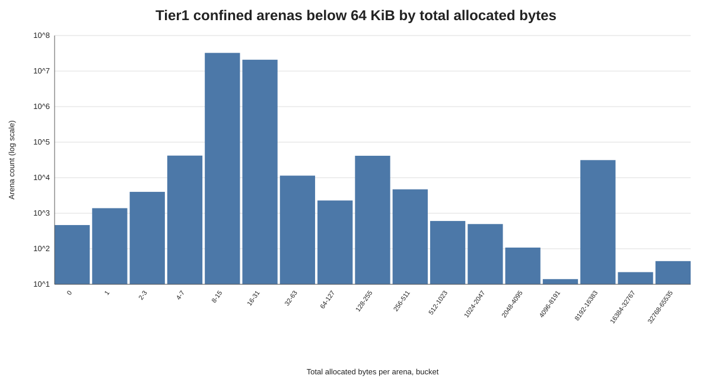
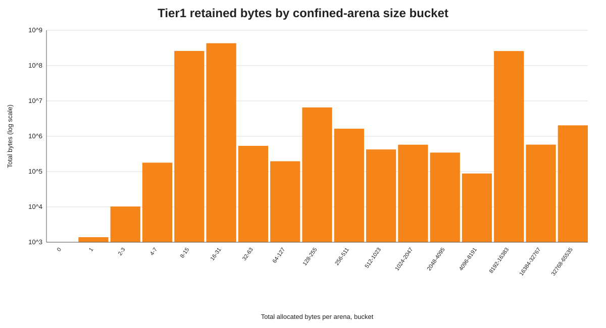
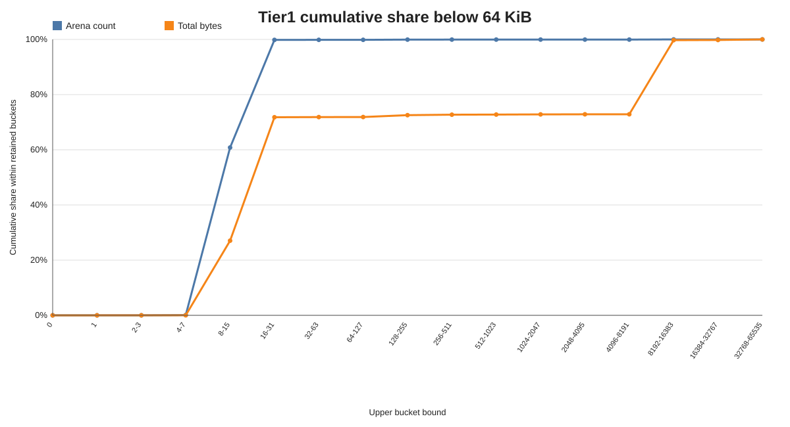
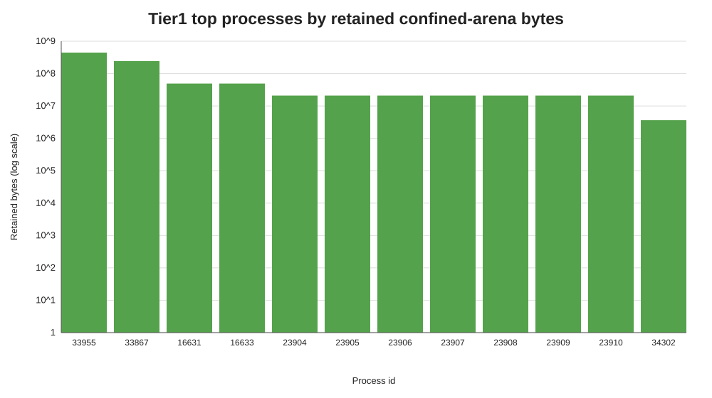

# Tier1 Confined Arena Allocation Histogram Summary, Buckets Below 64 KiB

Source: `/Users/minborg/dev/minborg-jdk/histograms`  
Scope: compound tier1 result after discarding buckets at or above 64 KiB. This keeps only buckets whose upper bound is less than 65,536 bytes, so the retained largest bucket is 32,768-65,535 bytes.

## Executive Summary

After filtering, the retained data contains 53,501,345 confined arenas and 961,659,632 B (917.11 MiB). This keeps 99.998% of the original arena count but only 23.240% of the original byte total. The discarded tail is tiny by count (0.002445%) but large by bytes (76.760%).

Within the retained distribution, small arenas dominate by count: 32,534,954 arenas (60.811%) allocated at most 15 bytes, and 53,408,972 arenas (99.827%) allocated at most 31 bytes. The largest retained count bucket is 8-15 bytes per arena with 32,487,238 arenas (60.722% of retained arenas). The largest retained byte bucket is 16-31 bytes per arena with 430,305,326 B (410.37 MiB) (44.746% of retained bytes).

## Key Metrics

| Metric | Value |
| --- | --- |
| Histogram blocks / JVMs | 120 / 120 |
| Retained cutoff | Buckets with maxBytes < 65,536 |
| Retained confined arenas closed | 53,501,345 |
| Retained allocated bytes | 961,659,632 B (917.11 MiB) |
| Retained share of original arenas | 99.998% |
| Retained share of original bytes | 23.240% |
| Discarded arenas | 1,308 (0.002445% of original) |
| Discarded bytes | 3,176,233,283 B (3,029.09 MiB) (76.760% of original) |
| Average bytes per retained arena | 17.97 B |
| Retained arenas with zero allocated bytes | 465 (0.000869%) |
| Retained arenas <= 15 bytes | 32,534,954 (60.811%) |
| Retained arenas <= 31 bytes | 53,408,972 (99.827%) |
| Retained bytes from arenas <= 31 bytes | 690,427,631 B (658.44 MiB) (71.795%) |
| Retained arenas 8 KiB-64 KiB | 31,325 (0.059%) |
| Retained bytes from arenas 8 KiB-64 KiB | 260,898,134 B (248.81 MiB) (27.130%) |

## Graphs

## Buckets With Most Arenas

| Bucket (bytes/arena) | Arena count | Retained arena share | Total bytes | Retained byte share | Avg bytes |
| --- | --- | --- | --- | --- | --- |
| 8-15 | 32,487,238 | 60.722% | 259,932,027 | 27.030% | 8.00 |
| 16-31 | 20,874,018 | 39.016% | 430,305,326 | 44.746% | 20.61 |
| 4-7 | 41,866 | 0.078% | 178,629 | 0.019% | 4.27 |
| 128-255 | 41,408 | 0.077% | 6,535,585 | 0.680% | 157.83 |
| 8192-16383 | 31,258 | 0.058% | 258,282,221 | 26.858% | 8262.92 |
| 32-63 | 11,425 | 0.021% | 534,961 | 0.056% | 46.82 |
| 256-511 | 4,707 | 0.009% | 1,634,600 | 0.170% | 347.27 |
| 2-3 | 3,997 | 0.007% | 10,261 | 0.001% | 2.57 |

## Buckets With Most Bytes

| Bucket (bytes/arena) | Total bytes | Retained byte share | Arena count | Retained arena share | Avg bytes |
| --- | --- | --- | --- | --- | --- |
| 16-31 | 430,305,326 | 44.746% | 20,874,018 | 39.016% | 20.61 |
| 8-15 | 259,932,027 | 27.030% | 32,487,238 | 60.722% | 8.00 |
| 8192-16383 | 258,282,221 | 26.858% | 31,258 | 0.058% | 8262.92 |
| 128-255 | 6,535,585 | 0.680% | 41,408 | 0.077% | 157.83 |
| 32768-65535 | 2,037,352 | 0.212% | 45 | 0.000% | 45274.49 |
| 256-511 | 1,634,600 | 0.170% | 4,707 | 0.009% | 347.27 |
| 16384-32767 | 578,561 | 0.060% | 22 | 0.000% | 26298.23 |
| 1024-2047 | 576,171 | 0.060% | 496 | 0.001% | 1161.64 |

## Top Processes By Retained Recorded Bytes

| PID | Retained bytes | MiB | Retained arena count | Retained buckets |
| --- | --- | --- | --- | --- |
| 33955 | 445,179,856 | 424.56 | 22,822,241 | 3 |
| 33867 | 244,448,775 | 233.12 | 30,481,765 | 12 |
| 16631 | 49,217,536 | 46.94 | 6,008 | 1 |
| 16633 | 49,217,536 | 46.94 | 6,008 | 1 |
| 23904 | 20,905,984 | 19.94 | 2,552 | 1 |
| 23905 | 20,905,984 | 19.94 | 2,552 | 1 |
| 23906 | 20,905,984 | 19.94 | 2,552 | 1 |
| 23907 | 20,905,984 | 19.94 | 2,552 | 1 |
| 23908 | 20,905,984 | 19.94 | 2,552 | 1 |
| 23909 | 20,905,984 | 19.94 | 2,552 | 1 |

## Interpretation

Removing buckets at or above 64 KiB eliminates almost all of the byte-weighted outlier effect while preserving nearly all arena closures. The retained average falls to 17.97 bytes per arena, and arenas at or below 31 bytes now account for 71.795% of retained bytes.

The filtered tier1 shape is therefore mostly a small-arena workload by count, with a meaningful retained byte contribution from the 8-16 KiB bucket. The 8 KiB-64 KiB retained buckets represent only 0.059% of retained arenas but contribute 27.130% of retained bytes, which is the main remaining non-tiny tail after removing larger buckets.

## Generated Artifacts

- `compound_histogram.csv`: filtered aggregate histogram across all JVM blocks.
- `per_process_summary.csv`: per-process retained arena count and byte totals.
- `arena_count_by_bucket.svg`: count-weighted retained bucket chart.
- `total_bytes_by_bucket.svg`: byte-weighted retained bucket chart.
- `cumulative_share.svg`: cumulative retained arena and byte shares.
- `top_processes_by_bytes.svg`: largest contributing JVMs after filtering.
