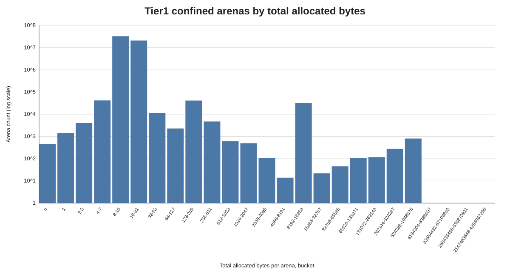
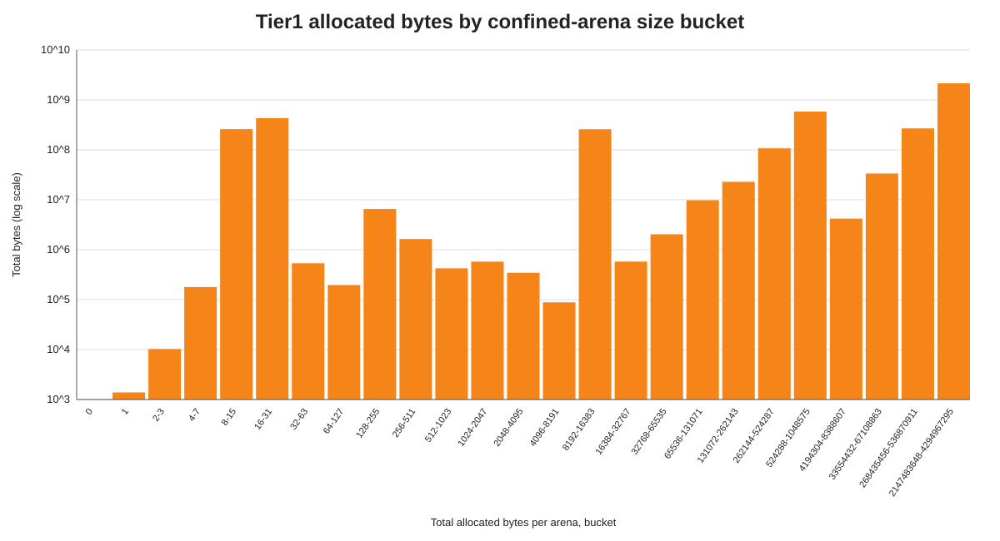
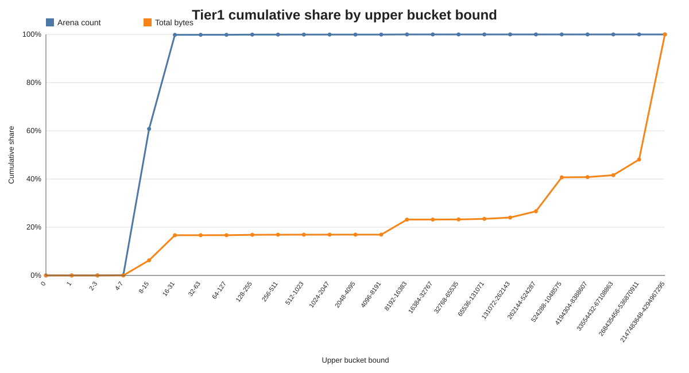
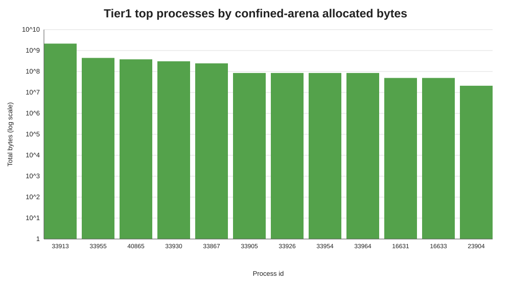

# Tier1 Confined Arena Allocation Histogram Summary

Source: `/Users/minborg/dev/minborg-jdk/histograms`  
Scope: compound result from all histogram blocks in the file after running the tier1 test suite.

## Executive Summary

The tier1 run produced 120 per-process histogram blocks and 53,502,653 closed confined arenas. The count distribution is concentrated in small arenas, but less exclusively than the earlier foreign-only run: 32,534,954 arenas (60.810%) allocated at most 15 bytes, and 53,408,972 arenas (99.825%) allocated at most 31 bytes.

The largest count bucket is 8-15 bytes per arena with 32,487,238 arenas (60.721% of all arenas). The largest byte bucket is 2147483648-4294967295 bytes per arena with 2,147,484,440 B (2,048.00 MiB) (51.898% of all bytes). Arenas up to 16 KiB cover 99.997% of arena count and 23.177% of bytes, while arenas at least 512 KiB are only 0.001508% of arenas but account for 73.381% of bytes.

## Key Metrics

| Metric | Value |
| --- | --- |
| Histogram blocks / JVMs | 120 / 120 |
| Total confined arenas closed | 53,502,653 |
| Total allocated bytes recorded | 4,137,892,915 B (3,946.20 MiB) |
| Average bytes per arena | 77.34 B |
| Arenas with zero allocated bytes | 465 (0.000869%) |
| Arenas <= 15 bytes | 32,534,954 (60.810%) |
| Arenas <= 31 bytes | 53,408,972 (99.825%) |
| Bytes from arenas <= 31 bytes | 690,427,631 B (658.44 MiB) (16.685%) |
| Arenas <= 16 KiB | 53,501,278 (99.997%) |
| Bytes from arenas <= 16 KiB | 959,043,719 B (914.62 MiB) (23.177%) |
| Arenas >= 512 KiB | 807 (0.001508%) |
| Bytes from arenas >= 512 KiB | 3,036,424,398 B (2,895.76 MiB) (73.381%) |

## Graphs

## Buckets With Most Arenas

| Bucket (bytes/arena) | Arena count | Arena share | Total bytes | Byte share | Avg bytes |
| --- | --- | --- | --- | --- | --- |
| 8-15 | 32,487,238 | 60.721% | 259,932,027 | 6.282% | 8.00 |
| 16-31 | 20,874,018 | 39.015% | 430,305,326 | 10.399% | 20.61 |
| 4-7 | 41,866 | 0.078% | 178,629 | 0.004% | 4.27 |
| 128-255 | 41,408 | 0.077% | 6,535,585 | 0.158% | 157.83 |
| 8192-16383 | 31,258 | 0.058% | 258,282,221 | 6.242% | 8262.92 |
| 32-63 | 11,425 | 0.021% | 534,961 | 0.013% | 46.82 |
| 256-511 | 4,707 | 0.009% | 1,634,600 | 0.040% | 347.27 |
| 2-3 | 3,997 | 0.007% | 10,261 | 0.000% | 2.57 |

## Buckets With Most Bytes

| Bucket (bytes/arena) | Total bytes | Byte share | Arena count | Arena share | Avg bytes |
| --- | --- | --- | --- | --- | --- |
| 2147483648-4294967295 | 2,147,484,440 | 51.898% | 1 | 0.000% | 2147484440.00 |
| 524288-1048575 | 582,755,763 | 14.083% | 803 | 0.002% | 725723.24 |
| 16-31 | 430,305,326 | 10.399% | 20,874,018 | 39.015% | 20.61 |
| 268435456-536870911 | 268,435,457 | 6.487% | 1 | 0.000% | 268435457.00 |
| 8-15 | 259,932,027 | 6.282% | 32,487,238 | 60.721% | 8.00 |
| 8192-16383 | 258,282,221 | 6.242% | 31,258 | 0.058% | 8262.92 |
| 262144-524287 | 107,140,353 | 2.589% | 276 | 0.001% | 388189.68 |
| 33554432-67108863 | 33,554,433 | 0.811% | 1 | 0.000% | 33554433.00 |

## Top Processes By Recorded Bytes

| PID | Total bytes | MiB | Arena count | Buckets |
| --- | --- | --- | --- | --- |
| 33913 | 2,147,484,440 | 2,048.00 | 1 | 1 |
| 33955 | 445,179,856 | 424.56 | 22,822,241 | 3 |
| 40865 | 381,010,614 | 363.36 | 990 | 9 |
| 33930 | 306,863,477 | 292.65 | 198 | 14 |
| 33867 | 244,448,775 | 233.12 | 30,481,765 | 12 |
| 33905 | 85,000,000 | 81.06 | 85 | 1 |
| 33926 | 85,000,000 | 81.06 | 85 | 1 |
| 33954 | 85,000,000 | 81.06 | 85 | 1 |
| 33964 | 85,000,000 | 81.06 | 85 | 1 |
| 16631 | 49,217,536 | 46.94 | 6,008 | 1 |

## Interpretation

The tier1 workload still exercises a large number of very small confined arenas, especially in the 16-31 and 8-15 byte buckets. Together, arenas at or below 31 bytes account for 99.825% of arena closures and 16.685% of bytes. This supports optimizing for very small confined-arena allocation footprints.

Compared with a purely tiny-arena workload, tier1 also contains a visible mid-size and large tail. The 8-16 KiB bucket is prominent by bytes, and the 512 KiB-1 MiB bucket contributes 14.083% of all bytes from only 803 arenas. The byte-weighted charts should therefore be read separately from the count-weighted charts when evaluating cache slot size and fallback behavior.

## Generated Artifacts

- `compound_histogram.csv`: aggregated histogram across all JVM blocks.
- `per_process_summary.csv`: per-process arena count and byte totals.
- `arena_count_by_bucket.svg`: count-weighted bucket chart.
- `total_bytes_by_bucket.svg`: byte-weighted bucket chart.
- `cumulative_share.svg`: cumulative arena and byte shares.
- `top_processes_by_bytes.svg`: largest contributing JVMs.
