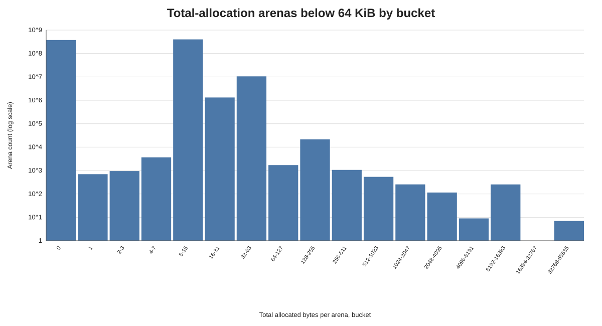
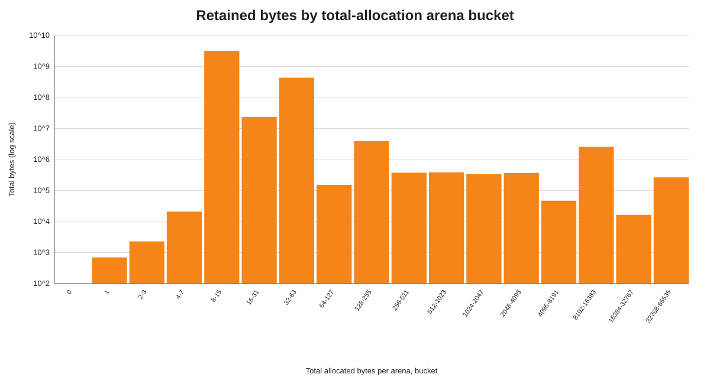
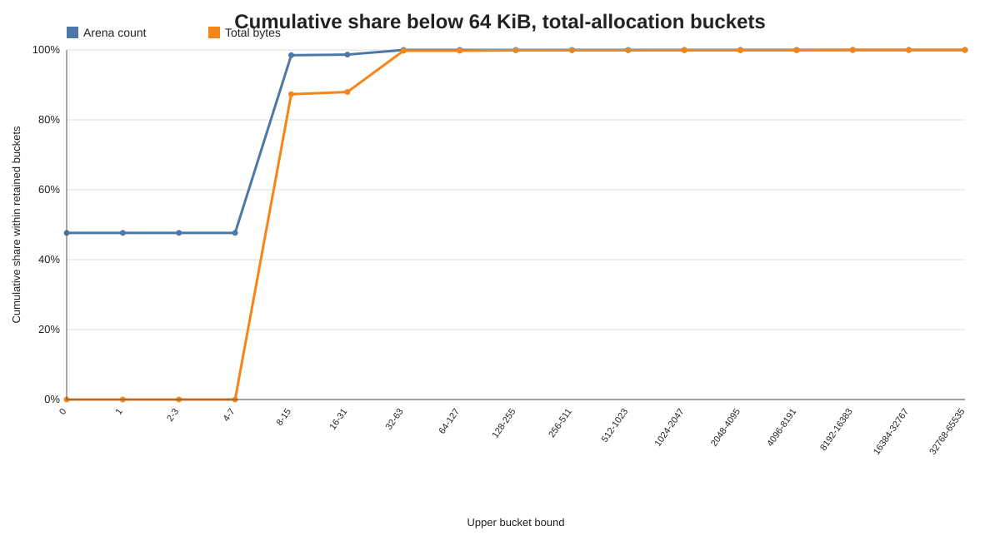
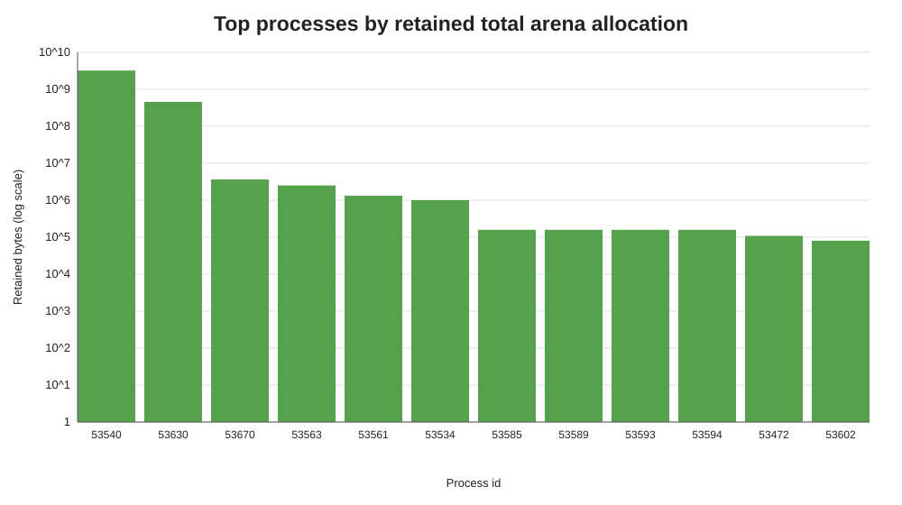

# Confined Arena Total Allocation Histogram Summary, Buckets Below 64 KiB

Source: `/Users/minborg/dev/minborg-jdk/histograms`  
Scope: compound result after discarding buckets at or above 64 KiB. Buckets represent total allocation accumulated by each confined arena.

## Executive Summary

After filtering, the retained data contains 788,772,608 confined arenas and 3,672,973,605 B (3,502.82 MiB). This keeps 100.000% of the original arena count and 53.583% of the original byte total. The discarded tail is tiny by count (0.000061%) but still contributes 46.417% of bytes.

Within retained buckets, zero-byte arenas dominate by count: 375,934,768 arenas (47.661%) have no recorded native allocation. Arenas at or below 63 bytes cover 99.997% of retained arena closures and 99.771% of retained bytes.

## Key Metrics

| Metric | Value |
| --- | --- |
| Histogram blocks / JVMs | 93 / 93 |
| Retained cutoff | Buckets with maxBytes < 65,536 |
| Retained confined arenas closed | 788,772,608 |
| Retained allocated bytes | 3,672,973,605 B (3,502.82 MiB) |
| Retained share of original arenas | 100.000% |
| Retained share of original bytes | 53.583% |
| Discarded arenas | 484 (0.000061% of original) |
| Discarded bytes | 3,181,763,099 B (3,034.37 MiB) (46.417% of original) |
| Average bytes per retained arena | 4.66 B |
| Retained zero-byte arenas | 375,934,768 (47.661%) |
| Retained arenas <= 31 bytes | 778,210,621 (98.661%) |
| Retained bytes from arenas <= 31 bytes | 3,231,340,337 B (3,081.65 MiB) (87.976%) |
| Retained arenas <= 63 bytes | 788,747,109 (99.997%) |
| Retained bytes from arenas <= 63 bytes | 3,664,546,412 B (3,494.78 MiB) (99.771%) |
| Retained arenas 8 KiB-64 KiB | 263 (0.000033%) |
| Retained bytes from arenas 8 KiB-64 KiB | 2,830,816 B (2.70 MiB) (0.077%) |

## Graphs

## Buckets With Most Arenas

| Bucket (bytes/arena) | Arena count | Retained arena share | Total bytes | Retained byte share | Avg bytes |
| --- | --- | --- | --- | --- | --- |
| 8-15 | 400,951,293 | 50.832% | 3,207,623,039 | 87.330% | 8.00 |
| 0 | 375,934,768 | 47.661% | 0 | 0.000% | 0.00 |
| 32-63 | 10,536,488 | 1.336% | 433,206,075 | 11.794% | 41.11 |
| 16-31 | 1,319,249 | 0.167% | 23,693,411 | 0.645% | 17.96 |
| 128-255 | 21,552 | 0.003% | 3,930,584 | 0.107% | 182.38 |
| 4-7 | 3,666 | 0.000% | 20,896 | 0.001% | 5.70 |
| 64-127 | 1,704 | 0.000% | 152,148 | 0.004% | 89.29 |
| 256-511 | 1,063 | 0.000% | 375,614 | 0.010% | 353.35 |

## Buckets With Most Bytes

| Bucket (bytes/arena) | Total bytes | Retained byte share | Arena count | Retained arena share | Avg bytes |
| --- | --- | --- | --- | --- | --- |
| 8-15 | 3,207,623,039 | 87.330% | 400,951,293 | 50.832% | 8.00 |
| 32-63 | 433,206,075 | 11.794% | 10,536,488 | 1.336% | 41.11 |
| 16-31 | 23,693,411 | 0.645% | 1,319,249 | 0.167% | 17.96 |
| 128-255 | 3,930,584 | 0.107% | 21,552 | 0.003% | 182.38 |
| 8192-16383 | 2,548,896 | 0.069% | 255 | 0.000% | 9995.67 |
| 512-1023 | 385,827 | 0.011% | 537 | 0.000% | 718.49 |
| 256-511 | 375,614 | 0.010% | 1,063 | 0.000% | 353.35 |
| 2048-4095 | 365,642 | 0.010% | 115 | 0.000% | 3179.50 |

## Top Processes By Retained Recorded Bytes

| PID | Retained bytes | MiB | Retained arena count | Retained buckets |
| --- | --- | --- | --- | --- |
| 53540 | 3,207,557,752 | 3,058.97 | 757,500,000 | 2 |
| 53630 | 455,751,120 | 434.64 | 30,625,910 | 3 |
| 53670 | 3,640,810 | 3.47 | 20,003 | 2 |
| 53563 | 2,500,000 | 2.38 | 250 | 1 |
| 53561 | 1,321,555 | 1.26 | 11,398 | 17 |
| 53534 | 1,001,004 | 0.95 | 41,385 | 6 |
| 53585 | 158,380 | 0.15 | 276 | 12 |
| 53589 | 158,380 | 0.15 | 276 | 12 |
| 53593 | 158,380 | 0.15 | 276 | 12 |
| 53594 | 158,380 | 0.15 | 276 | 12 |

## Interpretation

The 64 KiB cutoff removes only 484 arenas but removes 3,181,763,099 B (3,034.37 MiB). After filtering, the average retained arena allocation is 4.66 bytes. This view emphasizes the dominant zero/tiny-arena behavior while excluding large total-allocation arenas.

The retained byte view is overwhelmingly led by the 8-15 byte bucket, followed by the 32-63 byte bucket. The 8-15 byte bucket contributes 87.330% of retained bytes, while the 32-63 byte bucket contributes 11.794%. The 8 KiB-64 KiB buckets represent only 0.000033% of retained arenas and contribute 0.077% of retained bytes.

## Generated Artifacts

- `compound_histogram.csv`: filtered aggregate histogram across all JVM blocks.
- `per_process_summary.csv`: per-process retained arena count and byte totals.
- `arena_count_by_bucket.svg`: count-weighted retained bucket chart.
- `total_bytes_by_bucket.svg`: byte-weighted retained bucket chart.
- `cumulative_share.svg`: cumulative retained arena and byte shares.
- `top_processes_by_bytes.svg`: largest contributing JVMs after filtering.
