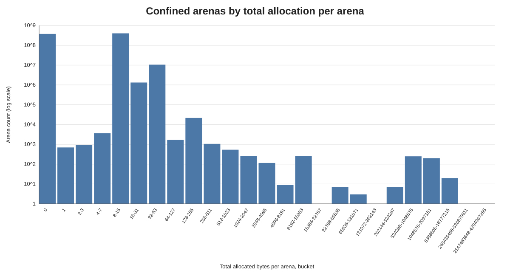
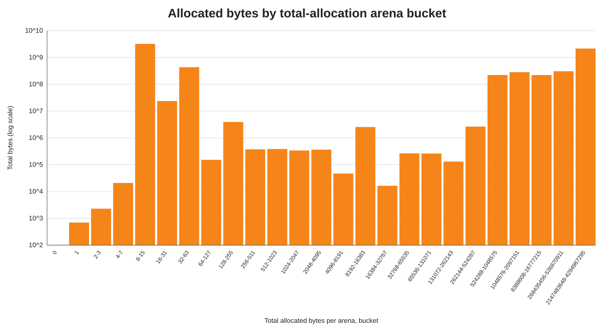
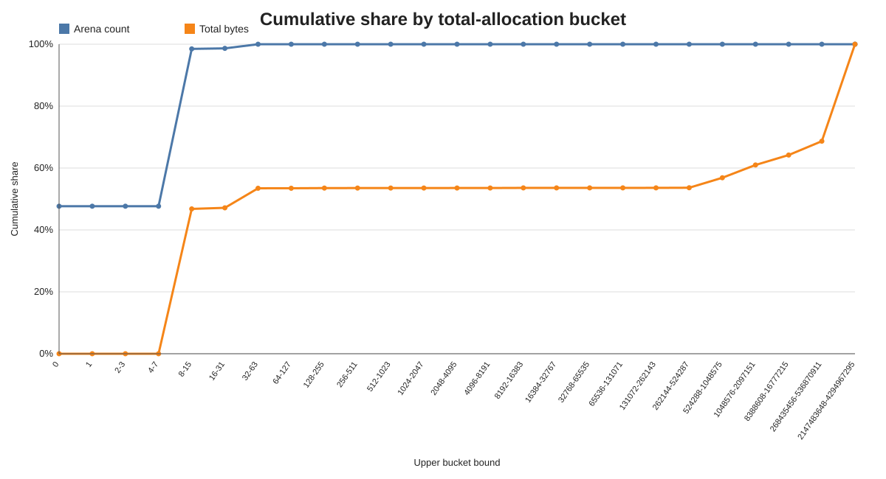
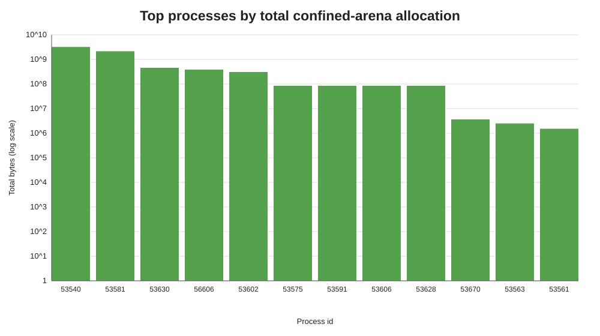

# Confined Arena Total Allocation Histogram Summary

Source: `/Users/minborg/dev/minborg-jdk/histograms`  
Scope: compound result from all histogram blocks in the file. Buckets represent the total allocation accumulated by each confined arena.

## Executive Summary

The run produced 93 per-process histogram blocks and 788,773,092 closed confined arenas. The result is dominated by arenas with no native allocation at all: 375,934,768 arenas (47.661%) are in the zero-byte bucket. Counting arenas up to 63 bytes covers 99.997% of all arena closures.

The largest count bucket is 8-15 bytes per arena with 400,951,293 arenas (50.832% of all arenas). The largest byte bucket is 8-15 bytes per arena with 3,207,623,039 B (3,059.03 MiB) (46.794% of all bytes). Buckets below 64 KiB preserve 100.000% of arena count and 53.583% of bytes.

## Key Metrics

| Metric | Value |
| --- | --- |
| Histogram blocks / JVMs | 93 / 93 |
| Total confined arenas closed | 788,773,092 |
| Total allocated bytes recorded | 6,854,736,704 B (6,537.19 MiB) |
| Average bytes per arena | 8.69 B |
| Arenas with zero allocated bytes | 375,934,768 (47.661%) |
| Arenas <= 15 bytes | 776,891,372 (98.494%) |
| Arenas <= 31 bytes | 778,210,621 (98.661%) |
| Bytes from arenas <= 31 bytes | 3,231,340,337 B (3,081.65 MiB) (47.140%) |
| Arenas <= 63 bytes | 788,747,109 (99.997%) |
| Bytes from arenas <= 63 bytes | 3,664,546,412 B (3,494.78 MiB) (53.460%) |
| Arenas < 64 KiB | 788,772,608 (100.000%) |
| Bytes from arenas < 64 KiB | 3,672,973,605 B (3,502.82 MiB) (53.583%) |
| Arenas >= 64 KiB | 484 (0.000061%) |
| Bytes from arenas >= 64 KiB | 3,181,763,099 B (3,034.37 MiB) (46.417%) |
| Arenas >= 512 KiB | 473 (0.000060%) |
| Bytes from arenas >= 512 KiB | 3,178,724,123 B (3,031.47 MiB) (46.373%) |

## Graphs

## Buckets With Most Arenas

| Bucket (bytes/arena) | Arena count | Arena share | Total bytes | Byte share | Avg bytes |
| --- | --- | --- | --- | --- | --- |
| 8-15 | 400,951,293 | 50.832% | 3,207,623,039 | 46.794% | 8.00 |
| 0 | 375,934,768 | 47.661% | 0 | 0.000% | 0.00 |
| 32-63 | 10,536,488 | 1.336% | 433,206,075 | 6.320% | 41.11 |
| 16-31 | 1,319,249 | 0.167% | 23,693,411 | 0.346% | 17.96 |
| 128-255 | 21,552 | 0.003% | 3,930,584 | 0.057% | 182.38 |
| 4-7 | 3,666 | 0.000% | 20,896 | 0.000% | 5.70 |
| 64-127 | 1,704 | 0.000% | 152,148 | 0.002% | 89.29 |
| 256-511 | 1,063 | 0.000% | 375,614 | 0.005% | 353.35 |

## Buckets With Most Bytes

| Bucket (bytes/arena) | Total bytes | Byte share | Arena count | Arena share | Avg bytes |
| --- | --- | --- | --- | --- | --- |
| 8-15 | 3,207,623,039 | 46.794% | 400,951,293 | 50.832% | 8.00 |
| 2147483648-4294967295 | 2,147,484,440 | 31.328% | 1 | 0.000% | 2147484440.00 |
| 32-63 | 433,206,075 | 6.320% | 10,536,488 | 1.336% | 41.11 |
| 268435456-536870911 | 306,783,385 | 4.475% | 1 | 0.000% | 306783385.00 |
| 1048576-2097151 | 283,202,448 | 4.131% | 202 | 0.000% | 1401992.32 |
| 524288-1048575 | 221,253,850 | 3.228% | 249 | 0.000% | 888569.68 |
| 8388608-16777215 | 220,000,000 | 3.209% | 20 | 0.000% | 11000000.00 |
| 16-31 | 23,693,411 | 0.346% | 1,319,249 | 0.167% | 17.96 |

## Top Processes By Recorded Bytes

| PID | Total bytes | MiB | Arena count | Buckets |
| --- | --- | --- | --- | --- |
| 53540 | 3,207,557,752 | 3,058.97 | 757,500,000 | 2 |
| 53581 | 2,147,484,440 | 2,048.00 | 1 | 1 |
| 53630 | 455,751,120 | 434.64 | 30,625,910 | 3 |
| 56606 | 383,826,258 | 366.05 | 330 | 2 |
| 53602 | 306,863,411 | 292.65 | 178 | 10 |
| 53575 | 85,000,000 | 81.06 | 35 | 2 |
| 53591 | 85,000,000 | 81.06 | 35 | 2 |
| 53606 | 85,000,000 | 81.06 | 35 | 2 |
| 53628 | 85,000,000 | 81.06 | 35 | 2 |
| 53670 | 3,640,810 | 3.47 | 20,003 | 2 |

## Interpretation

Capturing total allocation per arena shows a large population of arenas that close without native allocation. This changes the count-weighted view substantially: zero-byte arenas alone represent 47.661% of closures, while arenas at or below 63 bytes represent 99.997%.

The byte-weighted view is led by the 8-15 byte bucket, with additional weight from the 32-63 byte bucket and the large-allocation tail. The 8-15 byte bucket contributes 46.794% of all bytes, the 32-63 byte bucket contributes 6.320%, and arenas at or above 64 KiB are only 0.000061% of closures but contribute 46.417% of bytes. This suggests separating zero/tiny arenas from larger total-allocation arenas when evaluating confined-arena cache policy.

## Generated Artifacts

- `compound_histogram.csv`: aggregated histogram across all JVM blocks.
- `per_process_summary.csv`: per-process arena count and byte totals.
- `arena_count_by_bucket.svg`: count-weighted bucket chart.
- `total_bytes_by_bucket.svg`: byte-weighted bucket chart.
- `cumulative_share.svg`: cumulative arena and byte shares.
- `top_processes_by_bytes.svg`: largest contributing JVMs.
