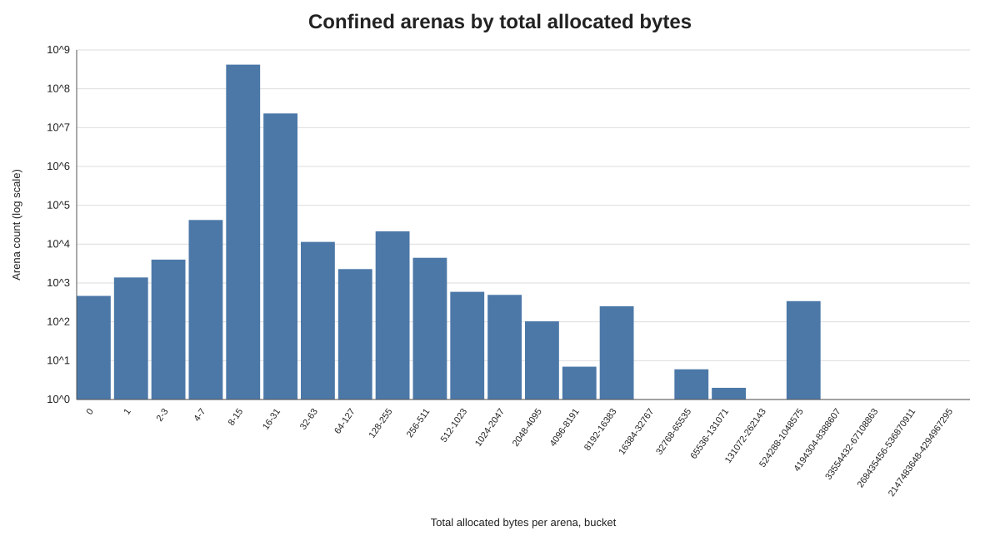
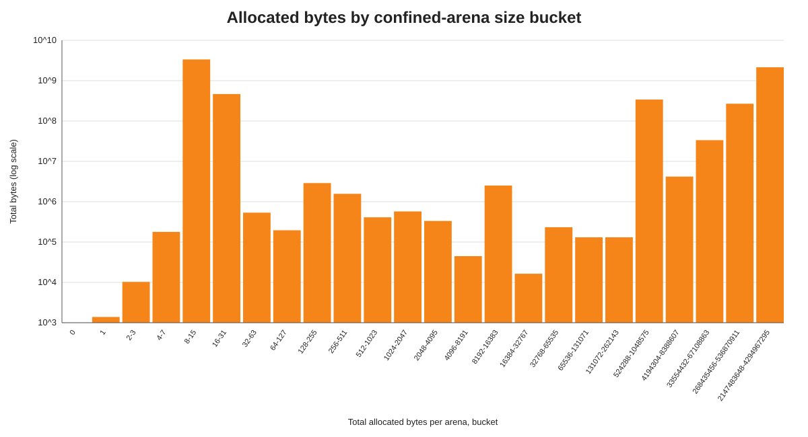
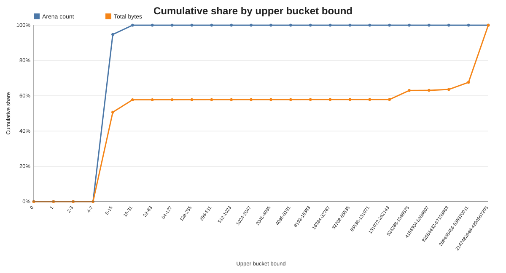
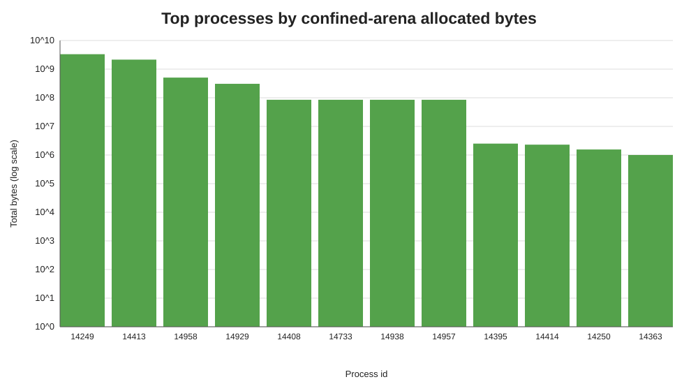

# Confined Arena Allocation Histogram Summary

Tests: test/jdk/java/foreign
Source: `/Users/minborg/dev/minborg-jdk/histograms`  
Scope: compound result from all histogram blocks in the file.

## Executive Summary

The run produced 65 per-process histogram blocks and 442,356,244 closed confined arenas. The distribution is dominated by very small arenas: 419,136,738 arenas (94.751%) allocated at most 15 bytes, and 442,314,874 arenas (99.991%) allocated at most 31 bytes. These tiny arenas still account for 57.723% of all recorded bytes because there are so many of them.

A very small number of large arenas materially affects the byte-weighted result. Only 345 arenas (0.000078%) allocated at least 512 KiB, but they account for 42.133% of all bytes. The single largest bucket, 2-4 GiB, contains one arena and contributes 32.381% of total recorded bytes.

## Key Metrics

| Metric | Value |
| --- | --- |
| Histogram blocks / JVMs | 65 / 65 |
| Total confined arenas closed | 442,356,244 |
| Total allocated bytes recorded | 6,631,871,608 B (6,324.65 MiB) |
| Average bytes per arena | 14.99 B |
| Arenas with zero allocated bytes | 465 (0.000105%) |
| Arenas <= 15 bytes | 419,136,738 (94.751%) |
| Arenas <= 31 bytes | 442,314,874 (99.991%) |
| Bytes from arenas <= 31 bytes | 3,828,094,263 B (3,650.76 MiB) (57.723%) |
| Arenas >= 512 KiB | 345 (0.000078%) |
| Bytes from arenas >= 512 KiB | 2,794,192,924 B (2,664.75 MiB) (42.133%) |

## Graphs

## Buckets With Most Arenas

| Bucket (bytes/arena) | Arena count | Arena share | Total bytes | Byte share | Avg bytes |
| --- | --- | --- | --- | --- | --- |
| 8-15 | 419,089,022 | 94.740% | 3,360,732,771 | 50.675% | 8.02 |
| 16-31 | 23,178,136 | 5.240% | 467,171,214 | 7.044% | 20.16 |
| 4-7 | 41,866 | 0.009% | 178,629 | 0.003% | 4.27 |
| 128-255 | 21,408 | 0.005% | 2,895,585 | 0.044% | 135.26 |
| 32-63 | 11,421 | 0.003% | 534,833 | 0.008% | 46.83 |
| 256-511 | 4,458 | 0.001% | 1,569,266 | 0.024% | 352.01 |
| 2-3 | 3,997 | 0.001% | 10,261 | 0.000% | 2.57 |
| 64-127 | 2,280 | 0.001% | 195,648 | 0.003% | 85.81 |

## Buckets With Most Bytes

| Bucket (bytes/arena) | Total bytes | Byte share | Arena count | Arena share | Avg bytes |
| --- | --- | --- | --- | --- | --- |
| 8-15 | 3,360,732,771 | 50.675% | 419,089,022 | 94.740% | 8.02 |
| 2147483648-4294967295 | 2,147,484,440 | 32.381% | 1 | 0.000% | 2147484440.00 |
| 16-31 | 467,171,214 | 7.044% | 23,178,136 | 5.240% | 20.16 |
| 524288-1048575 | 340,524,289 | 5.135% | 341 | 0.000% | 998604.95 |
| 268435456-536870911 | 268,435,457 | 4.048% | 1 | 0.000% | 268435457.00 |
| 33554432-67108863 | 33,554,433 | 0.506% | 1 | 0.000% | 33554433.00 |
| 4194304-8388607 | 4,194,305 | 0.063% | 1 | 0.000% | 4194305.00 |
| 128-255 | 2,895,585 | 0.044% | 21,408 | 0.005% | 135.26 |

## Top Processes By Recorded Bytes

| PID | Total bytes | MiB | Arena count | Buckets |
| --- | --- | --- | --- | --- |
| 14249 | 3,320,673,808 | 3,166.84 | 415,081,808 | 2 |
| 14413 | 2,147,484,440 | 2,048.00 | 1 | 1 |
| 14958 | 505,995,416 | 482.55 | 27,121,759 | 3 |
| 14929 | 306,863,477 | 292.65 | 198 | 14 |
| 14408 | 85,000,000 | 81.06 | 85 | 1 |
| 14733 | 85,000,000 | 81.06 | 85 | 1 |
| 14938 | 85,000,000 | 81.06 | 85 | 1 |
| 14957 | 85,000,000 | 81.06 | 85 | 1 |
| 14395 | 2,500,000 | 2.38 | 250 | 1 |
| 14414 | 2,298,274 | 2.19 | 29,081 | 12 |

## Interpretation

The count-weighted usage pattern strongly favors short-lived, tiny confined arenas. The 8-15 byte bucket alone contains 419,089,022 arenas (94.740% of all arenas). Adding the 16-31 byte bucket brings the cumulative count to 99.991%, which suggests the common case is a very small per-arena allocation footprint.

The byte-weighted picture is different because of outliers. The 8-15 byte bucket contributes about half of all bytes, but a single 2-4 GiB arena contributes nearly one third of all bytes. Treating large-arena outliers separately will make the common-case behavior easier to evaluate when comparing pooling strategies.

## Generated Artifacts

- `compound_histogram.csv`: aggregated histogram across all JVM blocks.
- `per_process_summary.csv`: per-process arena count and byte totals.
- `arena_count_by_bucket.svg`: count-weighted bucket chart.
- `total_bytes_by_bucket.svg`: byte-weighted bucket chart.
- `cumulative_share.svg`: cumulative arena and byte shares.
- `top_processes_by_bytes.svg`: largest contributing JVMs.
