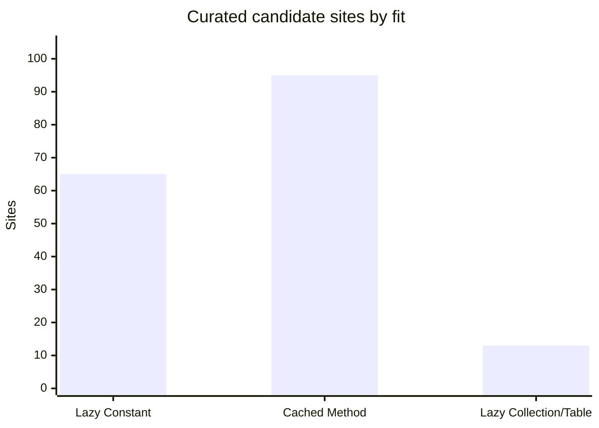
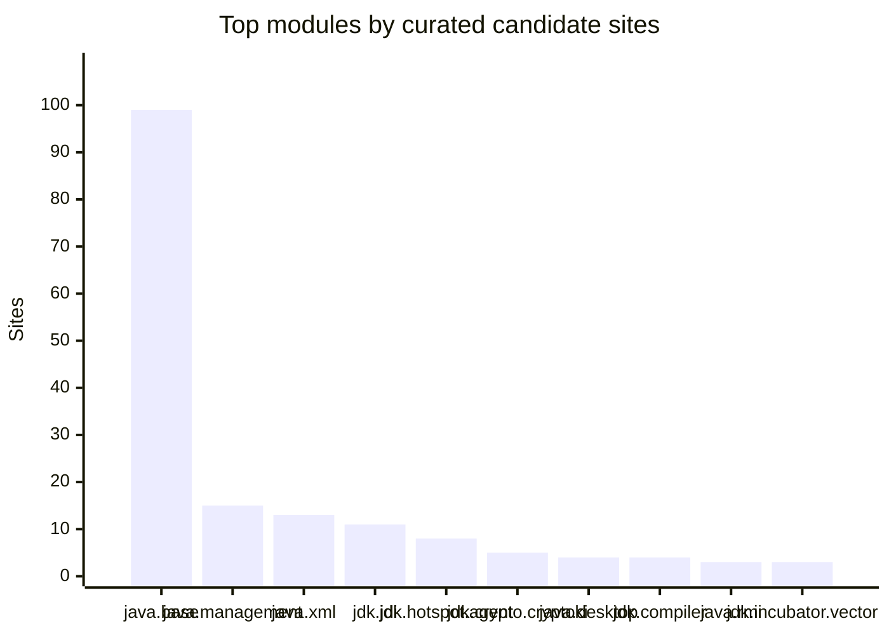

# JDK Lazy Constant and Cached Method Candidate Analysis

_Generated: 2026-06-09 from `/Users/minborg/dev/minborg-jdk/open`._

## Executive Summary

This pass combines broad mechanical scanning with manual triage of the high-value sites. The raw scan intentionally over-collected lazy fields, holder classes, memoized `toString`/`hashCode` fields, service-provider singletons, synchronized getters, and benign racy caches across all `src/*` module trees. The curated tables below separate likely conversions from patterns that look lazy but have invalidation, lifecycle, keying, native-resource, or first-argument semantics.

The main split is semantic:

- **Lazy Constant** is the better fit when current behavior depends on at-most-once initialization, holder-class initialization, stable property/provider snapshots, native/security state, or exception memoization.
- **Cached Method** is the better fit when the value is a pure or effectively pure no-argument derivation from immutable receiver/class state, duplicate computation is harmless, and retry after exception is acceptable.
- **Lazy collection/table** is the better fit for bounded indexed or keyed caches; scalar cached methods should not be stretched to cover those.

## Curated Totals

| Fit | Candidate sites |
|---|---:|
| Lazy Constant | 65 |
| Cached Method | 95 |
| Lazy Collection/Table | 13 |
| **Grand total** | **173** |

## Chart: Candidate Sites by Fit

## Module Summary

| Module | Lazy Constant | Cached Method | Lazy Collection/Table | Total | Visual |
|---|---:|---:|---:|---:|---|
| `java.base` | 40 | 49 | 10 | 99 | █████████████████████████████████████████████████ |
| `java.management` | 2 | 13 | 0 | 15 | ███████ |
| `java.xml` | 5 | 8 | 0 | 13 | ██████ |
| `jdk.jdi` | 0 | 11 | 0 | 11 | █████ |
| `jdk.hotspot.agent` | 0 | 8 | 0 | 8 | ████ |
| `jdk.crypto.cryptoki` | 5 | 0 | 0 | 5 | ██ |
| `java.desktop` | 4 | 0 | 0 | 4 | ██ |
| `jdk.compiler` | 2 | 2 | 0 | 4 | ██ |
| `java.rmi` | 3 | 0 | 0 | 3 | █ |
| `jdk.incubator.vector` | 0 | 0 | 3 | 3 | █ |
| `java.net.http` | 0 | 2 | 0 | 2 | █ |
| `jdk.javadoc` | 0 | 2 | 0 | 2 | █ |
| `jdk.management.agent` | 2 | 0 | 0 | 2 | █ |
| `jdk.crypto.mscapi` | 1 | 0 | 0 | 1 | █ |
| `jdk.internal.jvmstat` | 1 | 0 | 0 | 1 | █ |
| **Grand total** | **65** | **95** | **13** | **173** | |

## Chart: Top Modules

## Existing Lazy API Usage

| Module | Class | Current use | Comment |
|---|---|---|---|
| `java.base` | `java.nio.charset.Charset` | EXTENDED_PROVIDERS, defaultCharset, aliasSet | LazyConstant and Set.ofLazy already used for providers/default charset/alias sets. |
| `java.base` | `java.util.ResourceBundle` | keySet | Set.ofLazy already used for key set memoization. |
| `java.base` | `java.util.LocaleISOData` | ISO constants | Set.ofLazy already used for locale/currency code sets. |
| `java.base` | `java.util.Currency` | available | Set.ofLazy already used for available currencies. |
| `java.base` | `java.util.Locale` | LOCALE_CACHE, languageTag | LazyConstant/String cache already used. |
| `java.base` | `jdk.internal.foreign.CaptureStateUtil` | Map.ofLazy/List.ofLazy | Lazy collection usage already present. |
| `java.base` | `java.io.ProxyingConsole / jdk.internal.io.JdkConsoleImpl` | reader/printWriter/password console | LazyConstant already used for console-related initialization. |
| `java.base` | `java.time.ZoneOffset` | rules | LazyConstant already used for fixed zone rules. |
| `java.base` | `sun.security.ssl.SSLContextImpl` | cipher suite lists | LazyConstant already used for supported/default cipher suites. |

## Lazy Constant Candidates

| Module | Class/site | Lines | Sites | Confidence | Comments |
|---|---|---:|---:|---|---|
| `java.base` | `java.nio.channels.spi.AsynchronousChannelProvider.ProviderHolder` | `AsynchronousChannelProvider.java:60,133` | 1 | High | Holder-based default async-channel provider. LazyConstant is suitable for the provider object; not for event port/iocp resources created later. |
| `java.base` | `java.nio.channels.spi.SelectorProvider.Holder` | `SelectorProvider.java:79,152` | 1 | High | Holder-based default selector provider. LazyConstant could replace holder boilerplate while preserving provider-selection semantics. |
| `java.base` | `java.util.ListResourceBundle` | `ListResourceBundle.java:165` | 1 | High | Lookup map is synchronized lazy state derived from getContents(). If migrated, LazyConstant/List.ofLazy-style semantics are safer than cached because bundle contents may be user supplied. |
| `java.base` | `javax.net.ServerSocketFactory` | `ServerSocketFactory.java:73` | 1 | High | Same pattern as SocketFactory for default server socket factory; process-wide provider singleton. |
| `java.base` | `javax.net.SocketFactory` | `SocketFactory.java:93` | 1 | High | Default socket factory is a process-wide singleton with synchronized initialization and security/provider behavior. LazyConstant preserves at-most-once and exception memoization better than a racy cached method. |
| `java.base` | `javax.net.ssl.SSLServerSocketFactory.DefaultFactoryHolder` | `SSLServerSocketFactory.java:122` | 1 | High | Holder singleton for default SSL server socket factory; same at-most-once/provider semantics as SSLSocketFactory. |
| `java.base` | `javax.net.ssl.SSLSocketFactory.DefaultFactoryHolder` | `SSLSocketFactory.java:207` | 1 | High | Initialization-on-demand holder for default SSL socket factory. Good LazyConstant candidate because construction can fail and should not race provider setup. |
| `java.base` | `jdk.internal.logger.LoggerFinderLoader` | `LoggerFinderLoader.java:63,67` | 2 | High | Lazy service/provider discovery. At-most-once and exception memoization are preferable to duplicate discovery. |
| `java.base` | `sun.net.dns.ResolverConfiguration` | `ResolverConfiguration.java:55` | 1 | High | Provider selected reflectively once per process. LazyConstant matches holder/provider behavior and avoids duplicate native/provider initialization. |
| `java.base` | `sun.net.www.MimeTable.DefaultInstanceHolder` | `MimeTable.java:52,67` | 1 | High | Default MIME table singleton. LazyConstant preserves current holder semantics. |
| `java.base` | `sun.security.ssl.JsseJce.EcAvailability` | `JsseJce.java:158` | 1 | High | Lazy EC availability probe. At-most-once is desirable because this is a capability check tied to providers/native availability. |
| `java.base` | `sun.security.ssl.SSLConfiguration signature-scheme holders` | `SSLConfiguration.java:548,556` | 2 | High | Customized client/server signature scheme lists are expensive property-driven constants. LazyConstant keeps stable property snapshot and deterministic exception behavior. |
| `java.base` | `sun.security.ssl.SSLContextImpl holders` | `SSLContextImpl.java:943,1105` | 3 | High | Default managers and default SSL context are holder-class lazy singletons. LazyConstant expresses current class-init behavior more directly than cached. |
| `java.base` | `sun.security.util.DisabledAlgorithmConstraints holders` | `DisabledAlgorithmConstraints.java:92,97` | 2 | High | Security-property driven constraints. LazyConstant keeps property snapshot and avoids duplicate parsing. |
| `java.base` | `sun.security.util.ManifestEntryVerifier.SunProviderHolder` | `ManifestEntryVerifier.java:45,50` | 1 | High | Lazy provider singleton used during JAR verification; at-most-once is appropriate. |
| `java.base` | `sun.util.calendar.CalendarSystem.GregorianHolder` | `CalendarSystem.java:114,125` | 2 | High | Holder-based Gregorian calendar constants. Straight LazyConstant conversion candidate. |
| `java.base` | `sun.util.cldr.CLDRLocaleProviderAdapter` | `CLDRLocaleProviderAdapter.java:100,116,137,153` | 4 | High | Lazy CLDR provider objects and locale lists. Provider singleton construction should remain at-most-once. |
| `java.base` | `sun.util.locale.provider.FallbackLocaleProviderAdapter` | `FallbackLocaleProviderAdapter.java:85` | 1 | High | Lazy fallback provider construction; at-most-once semantics match current synchronized initialization. |
| `java.base` | `sun.util.locale.provider.JRELocaleProviderAdapter` | `JRELocaleProviderAdapter.java:135,151,167,183,199,215,234,250,266,282,298,317,336` | 13 | High | Many synchronized per-service provider fields. LazyConstant is a clean fit for each singleton provider object and avoids duplicate SPI/provider construction. |
| `java.desktop` | `com.sun.media.sound.JDK13Services` | `JDK13Services.java:186` | 1 | High | Global service properties are lazily loaded and shared. LazyConstant captures current property/service snapshot behavior. |
| `java.desktop` | `sun.font.FontManagerFactory` | `FontManagerFactory.java:44` | 1 | High | Font manager singleton uses privileged/reflection initialization. LazyConstant fits better than racy cached construction. |
| `java.desktop` | `sun.java2d.cmm.CMSManager` | `CMSManager.java:37,40` | 1 | High | Color-management module singleton chosen from properties/services. At-most-once module initialization is preferable. |
| `java.desktop` | `sun.java2d.pipe.RenderingEngine` | `RenderingEngine.java:112` | 1 | High | Reflective service/property singleton for rendering engine. LazyConstant preserves at-most-once setup and avoids duplicate provider init. |
| `java.management` | `java.lang.management.ManagementFactory` | `ManagementFactory.java:468` | 1 | High | PlatformMBeanServer uses synchronized lazy process-wide singleton. LazyConstant fits if no external reset is required. |
| `java.management` | `sun.management.ManagementFactoryHelper` | `ManagementFactoryHelper.java:338` | 1 | High | BufferPoolMXBean list is synchronized lazy process-wide management state. LazyConstant is a good fit if the set is immutable after boot. |
| `java.rmi` | `java.rmi.server.RMISocketFactory` | `RMISocketFactory.java:159` | 1 | High | Default socket factory is synchronized singleton state. LazyConstant matches current semantics; public setSocketFactory must be considered for mutable default state. |
| `java.rmi` | `javax.rmi.ssl.SslRMIClientSocketFactory` | `SslRMIClientSocketFactory.java:214` | 1 | High | Lazy default SSL client socket factory. Provider/security behavior makes LazyConstant preferable. |
| `java.rmi` | `javax.rmi.ssl.SslRMIServerSocketFactory` | `SslRMIServerSocketFactory.java:364` | 1 | High | Lazy default SSL server socket factory. LazyConstant preserves at-most-once provider construction. |
| `java.xml` | `com.sun.org.apache.xml.internal.serializer.OutputPropertiesFactory` | `OutputPropertiesFactory.java:298,308,315,328` | 4 | High | Several synchronized property tables loaded from resources. LazyConstant fits immutable, resource-backed defaults. |
| `java.xml` | `jdk.xml.internal.JdkXmlConfig.CatalogHolder` | `JdkXmlConfig.java:56` | 1 | High | Static holder for XML catalog features. LazyConstant expresses existing holder pattern. |
| `jdk.compiler` | `com.sun.tools.doclint.DocLint` | `DocLint.java:51` | 1 | High | Static Provider singleton. LazyConstant would remove manual static field without changing behavior. |
| `jdk.compiler` | `com.sun.tools.javac.file.FSInfo` | `FSInfo.java:155` | 1 | High | FileSystemProvider lookup is a lazy singleton. Provider lookup may throw; LazyConstant preserves one-shot semantics. |
| `jdk.crypto.cryptoki` | `sun.security.pkcs11.Secmod` | `Secmod.java:265,478,548` | 3 | High | NSS module/provider/trust state should not be duplicated because it represents native/security module state. LazyConstant is safer than cached. |
| `jdk.crypto.cryptoki` | `sun.security.pkcs11.Token` | `Token.java:386,393` | 2 | High | Lazy token SecureRandom and key store are native-token related. At-most-once avoids duplicate token object creation. |
| `jdk.crypto.mscapi` | `sun.security.mscapi.PRNG` | `PRNG.java:83` | 1 | High | Seed bytes are lazily initialized from native Windows crypto. LazyConstant is preferable if the existing one-shot seed behavior is intended. |
| `jdk.internal.jvmstat` | `sun.jvmstat.perfdata.monitor.protocol.local.LocalEventTimer` | `LocalEventTimer.java:57` | 1 | High | Process-wide timer singleton. LazyConstant directly expresses existing lazy singleton intent. |
| `jdk.management.agent` | `jdk.internal.agent.FileSystem` | `FileSystem.java:48` | 1 | High | Platform FileSystem singleton loaded reflectively. LazyConstant preserves at-most-once class/provider initialization. |
| `jdk.management.agent` | `sun.management.jmxremote.ConnectorBootstrap` | `ConnectorBootstrap.java:1054` | 1 | High | Default SSL socket factory helper in management agent; provider/security singleton fits LazyConstant. |

## Cached Method Candidates

| Module | Class/site | Lines | Sites | Confidence | Comments |
|---|---|---:|---:|---|---|
| `java.base` | `java.io.ObjectStreamField` | `ObjectStreamField.java:286` | 1 | High | Type signature is derived from immutable field type metadata; duplicate computation is harmless. |
| `java.base` | `java.lang.Class` | `Class.java:961` | 1 | High | name is VM-populated lazy metadata. Conceptual cached-method fit, but migration likely requires VM/JVM interface support rather than pure Java lowering. |
| `java.base` | `java.lang.ModuleLayer / java.lang.module.Configuration` | `ModuleLayer.java:769,804; Configuration.java:644` | 3 | High | parents/configuration/modules traversal sets are derived from immutable module graph state. cached is suitable if returned collections remain immutable. |
| `java.base` | `java.lang.invoke.LambdaForm.NamedFunction` | `LambdaForm.java:1085,1090` | 2 | High | resolvedHandle and invokerType are derived from immutable NamedFunction state. Existing benign races map well to cached methods. |
| `java.base` | `java.lang.invoke.MethodHandles.Lookup` | `MethodHandles.java:2394` | 1 | High | cachedProtectionDomain is a lazily derived object from lookupClass. Duplicate computation is harmless. |
| `java.base` | `java.lang.invoke.MethodType` | `MethodType.java:796,808,1148,1221` | 4 | High | descriptorString, toString, wrap, and unwrap are pure derived caches on immutable method types. Strong cached-method candidates. |
| `java.base` | `java.lang.invoke.StringConcatFactory` | `StringConcatFactory.java:513,529,537,546,555,564,573,582` | 8 | High | Static MethodHandle constants are lazily looked up. cached methods could remove boilerplate; LazyConstant is also defensible if lookup exceptions should be memoized. |
| `java.base` | `java.lang.reflect generic info` | `Method.java:104; Constructor.java:104; RecordComponent.java:132` | 3 | High | Generic metadata parser fields are racy lazy caches today. cached would document the intended best-effort memoization. |
| `java.base` | `java.lang.reflect.Parameter` | `Parameter.java:215,235,378` | 3 | High | Parameter realName, parameterClass, and declaredAnnotations are lazily derived reflection metadata. Cached method fits if annotation array/object identity expectations are preserved. |
| `java.base` | `java.math.BigDecimal` | `BigDecimal.java:3437` | 1 | High | stringCache memoizes toString output for immutable value. Duplicate string conversion is harmless. |
| `java.base` | `java.net.SocketPermission / java.util.PropertyPermission` | `SocketPermission.java:1131; PropertyPermission.java:334` | 2 | High | getActions string caches are derived from immutable mask state. Duplicate computation is cheap and harmless. |
| `java.base` | `java.nio.file.attribute.FileTime` | `FileTime.java:230,417` | 2 | High | instant and valueAsString are derived immutable views. Existing lazy fields are classic cached-method candidates. |
| `java.base` | `jdk.internal.classfile.impl.AbstractPoolEntry` | `AbstractPoolEntry.java:135-142,982,1021,1066` | 7 | High | Constant-pool entry string/symbol caches are derived from immutable classfile structures. cached can encode existing benign memoization. |
| `java.base` | `jdk.internal.constant desc implementations` | `ClassOrInterfaceDescImpl.java:63; ArrayClassDescImpl.java:110; PrimitiveClassDescImpl.java:92; MethodTypeDescImpl.java:284` | 4 | High | descriptorString/displayName caches on immutable constant descriptors. Strong cached-method candidates. |
| `java.base` | `path implementations` | `UnixPath.java:63,66,69; WindowsPath.java:68,71; JrtPath.java:419; ZipPath.java:63` | 7 | High | string/hash/absolute-path caches are pure derived values. Primitive hash caches need cached-method support for primitive sentinels or a wrapper strategy. |
| `java.management` | `javax.management.openmbean OpenMBean*InfoSupport` | `OpenMBeanConstructorInfoSupport.java:240,275; OpenMBeanOperationInfoSupport.java:338,375; OpenMBeanParameterInfoSupport.java:580,611; OpenMBeanAttributeInfoSupport.java:1039,1088; OpenMBeanInfoSupport.java:377` | 5 | High | Immutable management metadata caches hashCode/toString. These are strong cached-method targets. |
| `java.management` | `javax.management.openmbean immutable OpenType classes` | `ArrayType.java:741,767; SimpleType.java:254,279; CompositeType.java:406,437; TabularType.java:314,344` | 8 | High | hashCode/toString memoization on immutable descriptor objects. Duplicate computation is harmless and retry-after-exception is acceptable. |
| `java.net.http` | `jdk.internal.net.http.quic.frames.ConnectionCloseFrame` | `ConnectionCloseFrame.java:201,209` | 2 | High | reasonString and toString are pure derived values of immutable frame state. |
| `java.xml` | `Xerces/Xalan value caches` | `ConstantUtf8.java:143; Base64BinaryDV.java:66; HexBinaryDV.java:63; ListDV.java:65; PrecisionDecimalDV.java:380; NamespaceSupport.java:661; VariableRefBase.java:125; CharInfo.java:483` | 8 | High | Mostly string/list/toString canonical caches over immutable parser data. Use cached after verifying object mutability in each class. |
| `jdk.compiler` | `com.sun.tools.javac.file JRT caches` | `JRTIndex.java:60; JavacFileManager.java:454` | 2 | High | JRT filesystem/index caches can throw IOException. cached retry semantics may be better than LazyConstant exception memoization, but resource duplication must be checked. |
| `jdk.hotspot.agent` | `sun.jvm.hotspot.utilities.memo.Memoized*` | `MemoizedObject.java:27; MemoizedInt.java:27; MemoizedBoolean.java:27; MemoizedByte.java:27; MemoizedChar.java:27; MemoizedDouble.java:27; MemoizedFloat.java:27; MemoizedLong.java:27; MemoizedShort.java:27` | 8 | High | These utility classes already implement retry-on-exception, unsynchronized memoization. They are semantic prototypes for cached methods; primitive support is important. |
| `jdk.javadoc` | `jdk.javadoc.internal.tool.JavadocLog` | `JavadocLog.java:698,718` | 2 | High | sourcePositions/toolEnv are lazy views from an existing context. cached fits if context identity is immutable for the log lifetime. |
| `jdk.jdi` | `com.sun.tools.example.debug.expr.JNITypeParser` | `JNITypeParser.java:180,199` | 2 | High | Lazy signature and dimension parsing are pure string-derived values. |
| `jdk.jdi` | `com.sun.tools.jdi.VirtualMachineImpl primitive mirrors` | `VirtualMachineImpl.java:1195-1290` | 9 | High | Primitive Type mirrors are idempotent wrappers for a VM. cached methods fit if VM disposal/invalidation is not expected to refresh them. |

## Lazy Collection / Table Candidates

| Module | Class/site | Lines | Sites | Comments |
|---|---|---:|---:|---|
| `java.base` | `java.lang.invoke.Invokers` | `Invokers.java:53,74-119` | 1 | invokers[] is a lazily populated indexed cache of method handles. Best model is a lazy collection/table, not a scalar cached method. |
| `java.base` | `java.lang.reflect.AccessFlag` | `AccessFlag.java:723` | 1 | Existing comment notes future stable array and lazy initialization. Lazy collection support is a natural fit. |
| `java.base` | `java.lang.invoke.VarHandle` | `VarHandle.java:2119,2197` | 2 | methodTypeTable and methodHandleTable arrays are indexed lazy tables. Lazy collections or a purpose-built indexed LazyConstant array could express at-most-once per-slot semantics. |
| `java.base` | `java.lang.invoke.MethodHandleImpl` | `MethodHandleImpl.java:91,1465,4940` | 3 | Multiple method-handle caches and arrays; per-slot LazyConstant/lazy collection can prevent duplicate linkage work. |
| `java.base` | `sun.util.locale.provider.HostLocaleProviderAdapterImpl` | `HostLocaleProviderAdapterImpl.java:182,286,584` | 3 | AtomicReferenceArray provider caches are keyed by locale/category; candidate for lazy collection/table APIs if keys are bounded. |
| `jdk.incubator.vector` | `jdk.incubator.vector.VectorOperators` | `VectorOperators.java:1028,1339,1341` | 3 | Operator caches are keyed tables of canonical operator objects. Lazy collection/table support is more natural than cached methods. |

## Important Non-Candidates and Caveats

| Module | Site | Lines/pattern | Reason |
|---|---|---|---|
| `java.base` | `jdk.internal.platform.CgroupV1Subsystem / CgroupV2Subsystem` | `CgroupV1Subsystem.java:getInstance(Map); CgroupV2Subsystem.java:getInstance(CgroupInfo)` | First-call arguments determine the singleton. Neither LazyConstant nor no-arg cached method is a clean semantic match without restructuring. |
| `java.base` | `sun.nio.ch.*AsynchronousChannelProvider default event resources` | `Linux/EPoll/KQueue/Windows provider defaultEventPort/defaultIocp` | Creation starts native/event resources and can throw IOException. Racy cached computation risks duplicate resources; LazyConstant would memoize transient failures. |
| `java.base` | `javax.net.ssl.SSLContext default context` | `SSLContext.java:getDefault/setDefault` | Public setDefault makes this mutable process state, not a one-shot lazy constant. |
| `java.base` | `sun.security.jca.JCAUtil defSecureRandom` | `JCAUtil.java:getDefSecureRandom/clearDefSecureRandom` | Explicit invalidation on provider-list changes makes this an invalidating cache, not a pure cached method. |
| `java.base` | `keyed maps and ClassValue caches` | `ObjectStreamClass.Caches; ZoneRules.lastRulesCache; DecimalStyle.CACHE; ClassValue-like patterns` | Keyed/evicting/invalidating caches need map/table APIs, not scalar LazyConstant/cached lowering. |
| `java.desktop` | `Swing/AWT/UI delegate and weak-reference caches` | `various` | Many candidates are lifecycle-, AppContext-, or LookAndFeel-scoped and should not be converted to process-wide cached state. |
| `java.xml` | `DocumentCache, grammar pools, validation pools` | `various` | Lifecycle/keyed parser caches are intentionally mutable and should remain explicit cache structures. |

## Raw Scanner Summary

The field-filtered scanner examined **13,956** Java files and emitted **6,597** raw candidates. This is not the curated answer; it is the over-collection used to find candidates. Raw JSON: `/private/tmp/jdk_lazy_cached_candidates_raw_v4.json`; tabular export: `lazy-cached-raw-candidates.tsv`.

| Raw fit | Count |
|---|---:|
| Cached Method | 5,714 |
| Lazy Constant | 883 |

| Raw confidence | Count |
|---|---:|
| High | 639 |
| Medium | 2,316 |
| Low | 3,642 |

| Raw module/source root | Total | Lazy Constant | Cached Method | High | Medium | Low |
|---|---:|---:|---:|---:|---:|---:|
| `java.desktop` | 2406 | 623 | 1783 | 197 | 792 | 1417 |
| `java.base` | 1535 | 122 | 1413 | 253 | 575 | 707 |
| `java.xml` | 693 | 3 | 690 | 22 | 244 | 427 |
| `jdk.compiler` | 256 | 4 | 252 | 20 | 129 | 107 |
| `java.net.http` | 165 | 5 | 160 | 9 | 58 | 98 |
| `jdk.hotspot.agent` | 137 | 1 | 136 | 11 | 75 | 51 |
| `java.management` | 121 | 21 | 100 | 15 | 39 | 67 |
| `java.xml.crypto` | 105 | 1 | 104 | 2 | 73 | 30 |
| `jdk.jdi` | 96 | 3 | 93 | 18 | 19 | 59 |
| `java.security.jgss` | 80 | 7 | 73 | 7 | 27 | 46 |
| `java.naming` | 77 | 10 | 67 | 6 | 15 | 56 |
| `jdk.jconsole` | 75 | 4 | 71 | 9 | 19 | 47 |
| `jdk.javadoc` | 66 | 1 | 65 | 4 | 20 | 42 |
| `jdk.jfr` | 63 | 1 | 62 | 5 | 19 | 39 |
| `jdk.crypto.cryptoki` | 57 | 24 | 33 | 13 | 11 | 33 |
| `java.rmi` | 53 | 11 | 42 | 3 | 9 | 41 |
| `jdk.internal.le` | 48 | 2 | 46 | 1 | 15 | 32 |
| `java.sql.rowset` | 38 | 3 | 35 | 19 | 13 | 6 |
| `jdk.jshell` | 34 | 1 | 33 | 0 | 8 | 26 |
| `jdk.jlink` | 31 | 0 | 31 | 0 | 13 | 18 |
| `jdk.security.auth` | 31 | 0 | 31 | 0 | 10 | 21 |
| `jdk.jdeps` | 30 | 0 | 30 | 0 | 17 | 13 |
| `jdk.internal.md` | 28 | 0 | 28 | 0 | 10 | 18 |
| `jdk.httpserver` | 21 | 2 | 19 | 1 | 8 | 12 |
| `java.logging` | 20 | 2 | 18 | 4 | 5 | 11 |
| `jdk.accessibility` | 15 | 2 | 13 | 1 | 0 | 14 |
| `jdk.management` | 15 | 4 | 11 | 1 | 4 | 10 |
| `jdk.jartool` | 14 | 0 | 14 | 0 | 2 | 12 |
| `java.security.sasl` | 13 | 0 | 13 | 0 | 1 | 12 |
| `jdk.jpackage` | 13 | 0 | 13 | 0 | 8 | 5 |
| `jdk.zipfs` | 13 | 1 | 12 | 0 | 6 | 7 |
| `jdk.internal.jvmstat` | 12 | 5 | 7 | 1 | 0 | 11 |
| `java.management.rmi` | 11 | 0 | 11 | 0 | 1 | 10 |
| `java.prefs` | 11 | 3 | 8 | 0 | 0 | 11 |
| `jdk.crypto.mscapi` | 11 | 1 | 10 | 1 | 1 | 9 |
| `jdk.attach` | 9 | 1 | 8 | 0 | 5 | 4 |
| `jdk.dynalink` | 9 | 0 | 9 | 0 | 4 | 5 |
| `jdk.jcmd` | 9 | 0 | 9 | 0 | 6 | 3 |
| `java.datatransfer` | 8 | 2 | 6 | 4 | 1 | 3 |
| `jdk.management.agent` | 7 | 2 | 5 | 2 | 1 | 4 |
| `jdk.internal.opt` | 6 | 0 | 6 | 0 | 3 | 3 |
| `jdk.jstatd` | 6 | 3 | 3 | 0 | 1 | 5 |
| `jdk.incubator.vector` | 5 | 0 | 5 | 3 | 1 | 1 |
| `jdk.naming.dns` | 5 | 3 | 2 | 0 | 2 | 3 |
| `jdk.security.jgss` | 5 | 0 | 5 | 0 | 4 | 1 |
| `java.smartcardio` | 4 | 4 | 0 | 1 | 0 | 3 |
| `java.compiler` | 3 | 0 | 3 | 0 | 2 | 1 |
| `java.sql` | 3 | 0 | 3 | 0 | 0 | 3 |
| `java.instrument` | 2 | 0 | 2 | 0 | 0 | 2 |
| `jdk.management.jfr` | 2 | 0 | 2 | 0 | 0 | 2 |
| `jdk.sctp` | 2 | 0 | 2 | 0 | 1 | 1 |
| `jdk.charsets` | 1 | 1 | 0 | 1 | 0 | 0 |
| `jdk.editpad` | 1 | 0 | 1 | 0 | 0 | 1 |
| `jdk.localedata` | 1 | 0 | 1 | 0 | 1 | 0 |
| `jdk.naming.rmi` | 1 | 0 | 1 | 0 | 1 | 0 |

## Methodology

1. Scanned all `src/*` Java sources for explicit lazy idioms: `volatile`/`transient` memo fields, synchronized lazy getters, holder classes, `computeIfAbsent`, `AtomicReference`/CAS caches, `ClassValue`, `SoftReference`/`WeakReference` caches, and `hashCode`/`toString` memoization.
2. Filtered out obvious instance fields in constructors and method bodies so the high-confidence set focused on true fields and holder patterns.
3. Manually inspected representative hits in each module and classified by semantics rather than syntax.
4. Treated exception behavior as a deciding factor: LazyConstant is preferred when exception memoization and at-most-once behavior are part of the current contract; cached methods are preferred when retry and benign duplicate computation are acceptable.
5. Treated keyed, invalidating, scoped, or lifecycle-sensitive caches as non-candidates for scalar cached methods unless a lazy collection/table form is explicitly called out.

## Design Implications for `cached`

- Primitive cached methods matter. Several strong candidates are `int`/`long`/`boolean` memoizers (`hashCode`, path hash fields, hotspot-agent `MemoizedInt` and related utilities). A lowering strategy needs either a sentinel, companion boolean, or boxed field.
- Exception retry should be explicit in the language/API documentation because it deliberately differs from LazyConstant and holder-class initialization.
- The lowering should discourage use for resource-creating methods unless duplicate resource creation is demonstrably harmless. A CAS loser may need cleanup if the computed object owns native or OS resources.
- Some static `MethodHandle` and provider lookups are syntactically good cached-method candidates but semantically closer to LazyConstant if lookup failure should be stable.
- Lazy collection/table APIs appear independently useful; several important JDK caches are per-index or per-key and should not be forced through scalar cached methods.
