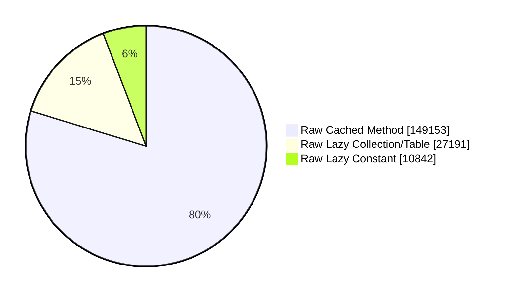
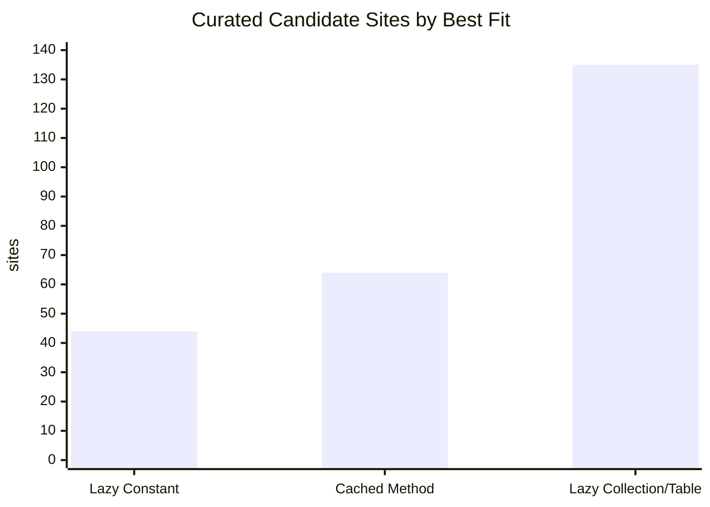

# Lazy Constants and Cached Methods: Open-Source Library Scan

Date: 2026-06-10

Source root used for this scan: `/private/tmp/openlib-lazy-scan/sources`. Line numbers in this report refer to those pinned snapshots.

Scope: Java source files only. That matches the proposed Java `cached` keyword and LazyConstant/lazy collection constructs. Spark and Kafka contain Scala sources; those were counted in the source-note column but not classified as Java-language candidates.

## Executive Summary

- Java files scanned: 88,014
- Raw scanner candidates: 187,186
- Curated, manually reviewed candidate sites: 243
- Curated best-fit split: Lazy Constant 44, Cached Method 64, Lazy Collection/Table 135
- Highest-value scalar cached-method examples: Spark `BestEffortLazyVal`, Guava `@LazyInit` derived views/values, JUnit reflective selectors, JavaFX immutable hash caches.
- Highest-value LazyConstant examples: JavaFX CSS converter holder classes, Hadoop/YARN singleton metrics holders, Tomcat/Netty holder singletons, Lucene analyzer resource holders.
- Highest-value lazy collection/table examples: Guava collection/table views, Hibernate metadata caches, Hadoop LoadingCaches, Kafka broker/client tables, Spark KV/network caches.

## Methodology

- Fetched shallow, blobless snapshots and checked out Java source files for each repository.
- Ran a broad line-window scanner for holder classes, volatile/transient memo fields, @LazyInit, computeIfAbsent/putIfAbsent, LoadingCache, and synchronized singleton idioms.
- Manually reviewed high-signal raw hits and grouped repeated idioms by library/module/class.
- Classified best fit by semantics, not by syntax: Lazy Constant for at-most-once singleton/holder initialization; Cached Method for pure or effectively pure scalar values where duplicate computation and exception retry are acceptable; Lazy Collection/Table for keyed caches or view tables.
- Raw totals are intentionally noisy and include false positives. Curated totals are the manually reviewed candidate groups in this report.

## Source Snapshots

| Library | Repo dir | Commit | Java files | Raw candidates | Non-Java note |
| --- | --- | --- | --- | --- | --- |
| Spring Boot | spring-boot | c3bbac6b5115 | 8,578 | 9,693 |  |
| Hibernate ORM | hibernate-orm | be8a28ab58b6 | 17,430 | 22,020 |  |
| Vaadin Flow | vaadin-flow | 6908f426ea30 | 3,810 | 4,722 |  |
| JUnit 5 | junit5 | 05b4ea07977e | 1,726 | 2,101 |  |
| Apache Hadoop | hadoop | ea0cb52c9a5c | 12,490 | 40,253 |  |
| Apache Kafka | kafka | b7b1c0a83d85 | 5,955 | 24,074 | 282 Scala files present |
| Apache Log4j | logging-log4j2 | 6beea3feb0e5 | 2,582 | 4,288 |  |
| Apache Lucene | lucene | 5aef0cd6fbc5 | 5,948 | 12,722 |  |
| Apache Spark | spark | 5001ba0b9969 | 1,322 | 2,077 | 6,073 Scala files present |
| Apache Tomcat | tomcat | d0ae65e75ec8 | 2,803 | 10,269 |  |
| Google Guava | guava | 3e65944ec920 | 3,227 | 10,050 |  |
| JavaFX | jfx | b1eccb6ed0d9 | 5,633 | 12,742 |  |
| Jetty | jetty.project | 9745c7e25d76 | 6,197 | 20,942 |  |
| LWJGL | lwjgl3 | eb2b5680d7cf | 6,790 | 5,396 |  |
| Netty | netty | 6ad888eb6464 | 3,523 | 5,837 |  |

## Raw Scanner Totals

| Best fit bucket | Raw candidates | Curated sites |
| --- | --- | --- |
| Lazy Constant | 10,842 | 44 |
| Cached Method | 149,153 | 64 |
| Lazy Collection/Table | 27,191 | 135 |

## Summary by Library

| Library | Java files | Raw total | Curated Lazy Constant | Curated Cached Method | Curated Lazy Collection/Table | Curated total | Curated per 1k Java files | Note |
| --- | --- | --- | --- | --- | --- | --- | --- | --- |
| Spring Boot | 8578 | 9693 | 0 | 3 | 4 | 7 | 0.82 |  |
| Hibernate ORM | 17430 | 22020 | 0 | 0 | 13 | 13 | 0.75 |  |
| Vaadin Flow | 3810 | 4722 | 1 | 0 | 8 | 9 | 2.36 |  |
| JUnit 5 | 1726 | 2101 | 0 | 5 | 9 | 14 | 8.11 |  |
| Apache Hadoop | 12490 | 40253 | 10 | 0 | 13 | 23 | 1.84 |  |
| Apache Kafka | 5955 | 24074 | 0 | 1 | 14 | 15 | 2.52 | 282 Scala files not classified for Java keyword applicability |
| Apache Log4j | 2582 | 4288 | 4 | 1 | 7 | 12 | 4.65 |  |
| Apache Lucene | 5948 | 12722 | 1 | 2 | 3 | 6 | 1.01 |  |
| Apache Spark | 1322 | 2077 | 2 | 2 | 11 | 15 | 11.35 | 6073 Scala files not classified for Java keyword applicability |
| Apache Tomcat | 2803 | 10269 | 3 | 0 | 5 | 8 | 2.85 |  |
| Google Guava | 3227 | 10050 | 0 | 28 | 27 | 55 | 17.04 |  |
| JavaFX | 5633 | 12742 | 18 | 20 | 5 | 43 | 7.63 |  |
| Jetty | 6197 | 20942 | 0 | 2 | 8 | 10 | 1.61 |  |
| LWJGL | 6790 | 5396 | 0 | 0 | 5 | 5 | 0.74 |  |
| Netty | 3523 | 5837 | 5 | 0 | 3 | 8 | 2.27 |  |

## Curated Candidate Volume Chart

| Library | Curated sites | Chart |
| --- | --- | --- |
| Google Guava | 55 | ################################## |
| JavaFX | 43 | ########################### |
| Apache Hadoop | 23 | ############## |
| Apache Kafka | 15 | ######### |
| Apache Spark | 15 | ######### |
| JUnit 5 | 14 | ######### |
| Hibernate ORM | 13 | ######## |
| Apache Log4j | 12 | ####### |
| Jetty | 10 | ###### |
| Vaadin Flow | 9 | ###### |
| Apache Tomcat | 8 | ##### |
| Netty | 8 | ##### |
| Spring Boot | 7 | #### |
| Apache Lucene | 6 | #### |
| LWJGL | 5 | ### |

## Candidate Table

The `sites` column counts grouped candidate sites. A grouped row is used when the same idiom repeats across related classes, for example JavaFX converter holders or Guava immutable collection view fields.

### Spring Boot
| Module | Class or group | Line refs | Best fit | Sites | Confidence | Comment |
| --- | --- | --- | --- | --- | --- | --- |
| buildpack/spring-boot-buildpack-platform | org.springframework.boot.buildpack.platform.docker.DockerApi | DockerApi.java:83,173 | Cached Method | 1 | high | Volatile ApiVersion memoized after a Docker API call. Duplicate calls are likely benign; exceptions already retry. |
| spring-boot-autoconfigure | AutoConfigurationImportSelector.AutoConfigurationGroup | AutoConfigurationImportSelector.java:447,514 | Cached Method | 1 | high | Lazily loads AutoConfigurationMetadata for an import group; pure classpath metadata read. |
| spring-boot-autoconfigure | AutoConfigurationSorter.AutoConfigurationClass | AutoConfigurationSorter.java:280 | Cached Method | 1 | high | Caches AnnotationMetadata for a class name. CAS duplicate metadata reads are acceptable. |
| spring-boot-autoconfigure | TemplateAvailabilityProviders | TemplateAvailabilityProviders.java:54,59,144 | Lazy Collection/Table | 2 | medium | Two keyed caches: provider resolution by view and bounded template availability cache. |
| spring-boot-buildpack-platform | DockerRegistryConfigAuthentication | DockerRegistryConfigAuthentication.java:46,122 | Lazy Collection/Table | 1 | medium | Static credential helper cache keyed by registry/server URL. Needs credential lifecycle review. |
| spring-boot-buildpack-platform | TotalProgressListener | TotalProgressListener.java:38,65 | Lazy Collection/Table | 1 | high | Layer progress objects are created on demand by layer id. |

### Hibernate ORM
| Module | Class or group | Line refs | Best fit | Sites | Confidence | Comment |
| --- | --- | --- | --- | --- | --- | --- |
| hibernate-core | org.hibernate.internal.util.collections.LazyIndexedMap | LazyIndexedMap.java:55 | Lazy Collection/Table | 1 | high | Purpose-built indexed lazy map; representative of keyed table demand. |
| hibernate-core | MutationBindTemplate | MutationBindTemplate.java:44 | Lazy Collection/Table | 1 | high | Synchronized static TEMPLATE_CACHE computeIfAbsent for mutation bind templates. |
| hibernate-core | CurrentTimestampGeneration | CurrentTimestampGeneration.java:165 | Lazy Collection/Table | 1 | high | Generator delegates are memoized by key with putIfAbsent. |
| hibernate-core | LazyAttributesMetadata | LazyAttributesMetadata.java:61 | Lazy Collection/Table | 1 | high | Lazy metadata table for enhanced attributes. |
| hibernate-core | CachingDatabaseInformationImpl | CachingDatabaseInformationImpl.java:49,61,73,87 | Lazy Collection/Table | 4 | high | Namespace, table, sequence, and key metadata caches. |
| hibernate-core | QueryInterpretationCacheStandardImpl | QueryInterpretationCacheStandardImpl.java:192 | Lazy Collection/Table | 1 | high | Native query parameter interpretation cache. |
| hibernate-core | TypeConfiguration | TypeConfiguration.java:658 | Lazy Collection/Table | 1 | medium | Array/tuple type cache keyed by type shape. |
| hibernate-core | InternalCache and LegacyInternalCacheImplementation | InternalCache.java:58; LegacyInternalCacheImplementation.java:47 | Lazy Collection/Table | 2 | medium | Cache abstraction and legacy implementation capture repeated compute-if-absent patterns. |
| hibernate-core | StatsNamedContainer | StatsNamedContainer.java:60,84 | Lazy Collection/Table | 1 | medium | Named statistics container has custom compute-if-absent behavior. |

### Vaadin Flow
| Module | Class or group | Line refs | Best fit | Sites | Confidence | Comment |
| --- | --- | --- | --- | --- | --- | --- |
| flow-server | com.vaadin.flow.internal.BeanUtil.LazyValidationAvailability | BeanUtil.java:384 | Lazy Constant | 1 | high | Initialization-on-demand holder computes bean validation availability once. |
| vaadin-spring | SpringLookupInitializer | SpringLookupInitializer.java:64,82 | Lazy Collection/Table | 2 | high | Caches service lookups and cacheability decisions by service type. |
| vaadin-spring | VaadinServletContextInitializer.CustomResourceLoader | VaadinServletContextInitializer.java:1023 | Lazy Collection/Table | 1 | medium | Lock-protected resource cache; table semantics fit better than scalar cached methods. |
| flow-server | ResourceContentHash | ResourceContentHash.java:43,73 | Lazy Collection/Table | 1 | high | Static ConcurrentHashMap caches resource content hashes by URL. |
| flow-server | StateNode | StateNode.java:146,224 | Lazy Collection/Table | 1 | high | Feature instances are cached by FeatureSetKey. |
| flow-server | ElementPropertyMap and ElementListenerMap | ElementPropertyMap.java:217; ElementListenerMap.java:350 | Lazy Collection/Table | 2 | medium | Per-node feature maps/listeners are allocated on demand. |
| flow-server | StateNode feature maps | StateNode.java:993 | Lazy Collection/Table | 1 | medium | Additional feature keyed cache site. |

### JUnit 5
| Module | Class or group | Line refs | Best fit | Sites | Confidence | Comment |
| --- | --- | --- | --- | --- | --- | --- |
| junit-platform-engine | MethodSource | MethodSource.java:199,214 | Cached Method | 2 | high | Lazily resolves Java class and method from names. Duplicate reflective lookups are benign. |
| junit-platform-engine | MethodSelector | MethodSelector.java:212,230,247 | Cached Method | 3 | high | Lazily resolves class, method, and parameter types. |
| junit-vintage-engine | TestSourceProvider | TestSourceProvider.java:44,63 | Lazy Collection/Table | 2 | high | Caches method and test source lookups by key. |
| junit-platform-commons | FallbackStringToObjectConverter | FallbackStringToObjectConverter.java:84,102 | Lazy Collection/Table | 1 | high | Factory executable cache keyed by target type. |
| junit-platform-commons | AnnotationUtils | AnnotationUtils.java:382 | Lazy Collection/Table | 1 | high | Repeatable annotation container cache. |
| junit-platform-commons | ReflectionUtils | ReflectionUtils.java:1447 | Lazy Collection/Table | 1 | high | Interface method lookup cache. |
| junit-jupiter-engine | CachingJupiterConfiguration | CachingJupiterConfiguration.java:84 | Lazy Collection/Table | 1 | medium | Configuration property cache; keyed by property, not scalar. |
| junit-jupiter-params | ResolutionCache and ResolverFacade | ResolutionCache.java:40; ResolverFacade.java:325 | Lazy Collection/Table | 2 | medium | Parameterized-test resolution caches. |
| junit-platform-engine | NamespacedHierarchicalStore | NamespacedHierarchicalStore.java:277,382 | Lazy Collection/Table | 1 | medium | Store API exposes keyed compute-if-absent semantics. |

### Apache Hadoop
| Module | Class or group | Line refs | Best fit | Sites | Confidence | Comment |
| --- | --- | --- | --- | --- | --- | --- |
| hadoop-yarn and hadoop-common | YARN/Hadoop metrics singleton group | ClusterMetrics.java:93,112; CapacitySchedulerMetrics.java:56; FederationStateStoreServiceMetrics.java:49; RouterMetrics.java:431; AMRMProxyMetrics.java:83; OpportunisticSchedulerMetrics.java:50; AMRMClientRelayerMetrics.java:77; WebServiceClient.java:42 | Lazy Constant | 8 | medium | Volatile singleton metrics/services. At-most-once matters because constructors register metrics or create threads. |
| hadoop-common | DelegationTokenRenewer | DelegationTokenRenewer.java:194,201 | Lazy Constant | 1 | medium | Synchronized lazy singleton. Test reset means production conversion needs reset policy review. |
| hadoop-common | RefreshRegistry.RegistryHolder | RefreshRegistry.java:41,47 | Lazy Constant | 1 | high | Classic initialization-on-demand holder singleton. |
| hadoop-common | Groups | Groups.java:80,135,142 | Lazy Collection/Table | 2 | medium | Positive and negative group lookup caches with TTL/refresh behavior. |
| hadoop-common | SecurityUtil.CacheableHostResolver | SecurityUtil.java:603,607,623 | Lazy Collection/Table | 1 | medium | Host resolution LoadingCache keyed by hostname with expiry. |
| hadoop-common | PrometheusMetricsSink | PrometheusMetricsSink.java:80,97 | Lazy Collection/Table | 2 | high | Static normalized-name LoadingCache and per-record metric map computeIfAbsent. |
| hadoop-common | CodecPool | CodecPool.java:61,75,81 | Lazy Collection/Table | 2 | medium | Usage-count LoadingCaches by codec class. |
| hadoop-yarn-server-nodemanager | ResourceLocalizationService | ResourceLocalizationService.java:508 | Lazy Collection/Table | 1 | medium | FileStatus LoadingCache for localization status lookups. |
| hadoop-hdfs-rbf | RouterRpcServer | RouterRpcServer.java:294,481 | Lazy Collection/Table | 1 | medium | Datanode report LoadingCache with router expiry semantics. |
| hadoop-hdfs-rbf | MountTableRefresherService | MountTableRefresherService.java:81,120 | Lazy Collection/Table | 1 | medium | RouterClient LoadingCache with bounded lifetime. |
| hadoop-common | ViewFileSystem | ViewFileSystem.java:129,143 | Lazy Collection/Table | 1 | high | FileSystem instances are cached by URI/config key. |
| hadoop-common | DiskValidatorFactory | DiskValidatorFactory.java:52 | Lazy Collection/Table | 1 | high | Validator instances cached by class with putIfAbsent. |
| hadoop-azure | AggregateMetricsManager | AggregateMetricsManager.java:38,124 | Lazy Collection/Table | 1 | medium | Singleton manager plus bucket table keyed by account. |

### Apache Kafka
| Module | Class or group | Line refs | Best fit | Sites | Confidence | Comment |
| --- | --- | --- | --- | --- | --- | --- |
| clients | CachedSupplier | CachedSupplier.java:30,37 | Cached Method | 1 | medium | Single-threaded supplier memoizer. A cached method can express retry-on-exception, but would add thread-safe racing semantics. |
| core | SharePartitionCache | SharePartitionCache.java:92 | Lazy Collection/Table | 1 | high | Thread-safe cache API with group side table and computeIfAbsent. |
| core | SharePartitionManager | SharePartitionManager.java:763 | Lazy Collection/Table | 1 | high | SharePartition creation is delegated to SharePartitionCache. |
| storage | BrokerTopicStats | BrokerTopicStats.java:50 | Lazy Collection/Table | 1 | high | BrokerTopicMetrics created per topic on demand. |
| group-coordinator | StreamsGroup | StreamsGroup.java:749,761 | Lazy Collection/Table | 1 | medium | Topic metadata hash cache passed into computation. |
| clients producer | RecordAccumulator | RecordAccumulator.java:290,318,948,993 | Lazy Collection/Table | 4 | medium | Topic, partition, drain-index, and node-latency maps are lazily populated. |
| clients consumer | AbstractFetch and ShareConsumeRequestManager | AbstractFetch.java:469; ShareConsumeRequestManager.java:177,309 | Lazy Collection/Table | 3 | medium | Fetch/session handler maps keyed by node and topic partition. |
| clients producer | RoundRobinPartitioner | RoundRobinPartitioner.java:67 | Lazy Collection/Table | 1 | high | Per-topic AtomicInteger counters created on demand. |
| group-coordinator | RangeAssignor | RangeAssignor.java:198 | Lazy Collection/Table | 1 | medium | TopicMetadata table is populated by topic id. |
| group-coordinator | OffsetMetadataManager | OffsetMetadataManager.java:220,385,1190 | Lazy Collection/Table | 1 | medium | Nested timeline maps are created on demand. |

### Apache Log4j
| Module | Class or group | Line refs | Best fit | Sites | Confidence | Comment |
| --- | --- | --- | --- | --- | --- | --- |
| log4j-api | LazyUtil.SafeLazy | LazyUtil.java:96 | Lazy Constant | 1 | medium | Existing utility has lock-protected at-most-once semantics, with reset/set APIs to review. |
| log4j-api | LazyUtil.PureLazy | LazyUtil.java:143 | Cached Method | 1 | medium | Unsynchronized pure lazy wrapper is close to benign-race cached semantics if duplicate computation is acceptable. |
| log4j-api | ThreadDumpMessage.FACTORY | ThreadDumpMessage.java:44 | Lazy Constant | 1 | high | Static Lazy factory for thread dump implementation. |
| log4j-core | Context selector default logger contexts | ClassLoaderContextSelector.java:57; BasicContextSelector.java:32 | Lazy Constant | 2 | medium | Static Lazy logger context factories; check shutdown/reset behavior before conversion. |
| log4j-1.2-api | Hierarchy | Hierarchy.java:100,111,119 | Lazy Collection/Table | 2 | high | WeakHashMap of logger contexts and per-context logger maps. |
| log4j-api | MarkerManager | MarkerManager.java:63 | Lazy Collection/Table | 1 | high | Marker registry computeIfAbsent keyed by marker name. |
| log4j-core | LoggerContext | LoggerContext.java:588 | Lazy Collection/Table | 1 | high | LoggerRegistry lookup/create by logger name. |
| log4j-api | LoggerRegistry | LoggerRegistry.java:276 | Lazy Collection/Table | 1 | high | Nested registry maps computeIfAbsent. |
| log4j-core | FormatCache and FastDatePrinter | FormatCache.java:86,209; FastDatePrinter.java:1291 | Lazy Collection/Table | 2 | medium | Date/time formatter caches keyed by pattern/locale/time zone. |

### Apache Lucene
| Module | Class or group | Line refs | Best fit | Sites | Confidence | Comment |
| --- | --- | --- | --- | --- | --- | --- |
| analysis-common | TurkishAnalyzer.DefaultSetHolder | TurkishAnalyzer.java:62 | Lazy Constant | 1 | high | Initialization-on-demand holder for default stop words. |
| analysis-morfologik | UkrainianMorfologikAnalyzer.defaultResources | UkrainianMorfologikAnalyzer.java:68,70 | Cached Method | 1 | medium | Volatile synchronized lazy resource pair lacks inner recheck, so duplicate computation can already happen under a race; exceptions retry. |
| suggest | CompletionsTermsReader | CompletionsTermsReader.java:64 | Cached Method | 1 | medium | Per-reader suggester loaded on demand from IndexInput. Duplicate load would be expensive but semantically benign if IO source is stable. |
| queryparser | NLS | NLS.java:82,85 | Lazy Collection/Table | 1 | medium | Message bundle registry uses putIfAbsent by bundle name. |
| core | MMapDirectory | MMapDirectory.java:401,411 | Lazy Collection/Table | 1 | medium | Shared Arena table keyed by grouping function result with ref-count lifecycle. |
| queryparser | MultiPhraseQueryNodeBuilder | MultiPhraseQueryNodeBuilder.java:56 | Lazy Collection/Table | 1 | low | Local position-to-term map; lower value but a clean computeIfAbsent shape. |

### Apache Spark
| Module | Class or group | Line refs | Best fit | Sites | Confidence | Comment |
| --- | --- | --- | --- | --- | --- | --- |
| common/utils-java | UUIDv7Generator.Holder | UUIDv7Generator.java:41 | Lazy Constant | 1 | high | Holder-class SecureRandom singleton. |
| sql/api | SpatialReferenceSystemCache | SpatialReferenceSystemCache.java:50 | Lazy Constant | 1 | medium | DCL singleton that loads spatial reference resources. |
| core | BestEffortLazyVal | BestEffortLazyVal.java:44,63 | Cached Method | 1 | high | Existing CAS-based best-effort lazy value exactly matches duplicate-compute, one-winner, retry-on-exception semantics. |
| core | TransientBestEffortLazyVal | TransientBestEffortLazyVal.java:50,68 | Cached Method | 1 | high | Transient variant of the CAS best-effort lazy utility. |
| network-common | TransportClientFactory | TransportClientFactory.java:163 | Lazy Collection/Table | 1 | high | Connection pool entries created by remote address. |
| kvstore | LevelDB, RocksDB, InMemoryStore | LevelDB.java:357,383; RocksDB.java:389,415; InMemoryStore.java:156,272 | Lazy Collection/Table | 6 | high | Entity/index metadata caches in key-value stores. |
| unsafe | HeapMemoryAllocator | HeapMemoryAllocator.java:108 | Lazy Collection/Table | 1 | high | Buffer pools are created by allocation size. |
| network-shuffle | RemoteBlockPushResolver and OneForOneBlockFetcher | RemoteBlockPushResolver.java:283,900; OneForOneBlockFetcher.java:172,211 | Lazy Collection/Table | 3 | medium | Shuffle/block fetch maps populated by block or app keys. |

### Apache Tomcat
| Module | Class or group | Line refs | Best fit | Sites | Confidence | Comment |
| --- | --- | --- | --- | --- | --- | --- |
| catalina | BufferPool | BufferPool.java:40,50 | Lazy Constant | 1 | high | Volatile DCL singleton buffer pool. |
| catalina | TomcatURLStreamHandlerFactory | TomcatURLStreamHandlerFactory.java:36,44 | Lazy Constant | 1 | medium | DCL singleton with registration side effects; requires lifecycle review. |
| juli | OneLineFormatter ThreadMXBean | OneLineFormatter.java:42,245 | Lazy Constant | 1 | high | Static ThreadMXBean is initialized lazily under lock. |
| catalina | AbstractArchiveResourceSet | AbstractArchiveResourceSet.java:60 | Lazy Collection/Table | 1 | medium | Archive entry map is loaded lazily; table/resource semantics. |
| catalina | CsrfPreventionFilter.NonceCache | CsrfPreventionFilter.java:367 | Lazy Collection/Table | 1 | medium | Nonce cache has eviction/security semantics; not a scalar cached method. |
| catalina | LockOutRealm | LockOutRealm.java:80 | Lazy Collection/Table | 1 | medium | Failure cache keyed by principal/address. |
| catalina | ApplicationHttpRequest | ApplicationHttpRequest.java:126 | Lazy Collection/Table | 1 | low | Request parameters map is populated lazily per request. |
| catalina | CGIServlet | CGIServlet.java:644 | Lazy Collection/Table | 1 | low | CGI environment map is assembled lazily. |

### Google Guava
| Module | Class or group | Line refs | Best fit | Sites | Confidence | Comment |
| --- | --- | --- | --- | --- | --- | --- |
| guava | Converter.reverse | Converter.java:150 | Cached Method | 1 | high | Reverse converter field is a derived receiver value marked @LazyInit. |
| guava | MediaType | MediaType.java:949,951,955 | Cached Method | 3 | high | toString, hashCode, and charset-style derived values are memoized with @LazyInit/sentinels. |
| guava | InternetDomainName | InternetDomainName.java:126,137 | Cached Method | 2 | high | Suffix-related derived fields are lazy receiver values. |
| guava | ImmutableMap views | ImmutableMap.java:1046,1060,1101,1121 | Cached Method | 4 | high | entrySet, keySet, values, and multimap view are lazy derived views. |
| guava | Immutable collection inverse/view group | ImmutableSet.java:313; ImmutableSetMultimap.java:549,604; ImmutableListMultimap.java:461; ImmutableRangeSet.java:406,593; HashBiMap.java:609; RegularImmutableBiMap.java:194; SingletonImmutableBiMap.java:98; JdkBackedImmutableBiMap.java:83 | Cached Method | 10 | high | Immutable view/inverse fields are receiver-derived and duplicate computation is benign. |
| guava | BaseEncoding | BaseEncoding.java:885 | Cached Method | 3 | high | upperCase, lowerCase, and ignoreCase encodings are cached derived variants. |
| guava | TypeToken | TypeToken.java:110,113 | Cached Method | 2 | high | Invariant and covariant type resolvers are lazy derived state. |
| guava | LinearTransformation | LinearTransformation.java:172,207,230,263 | Cached Method | 3 | high | Inverse transformations are lazy, pure derived objects. |
| guava | AbstractMultimap | AbstractMultimap.java:114,162,172,182,228 | Lazy Collection/Table | 5 | high | Lazy collection views for entries, keys, values, and asMap. |
| guava | AbstractTable and StandardTable | AbstractTable.java:122,185; StandardTable.java:683,813,886 | Lazy Collection/Table | 5 | high | Lazy table view collections/maps. |
| guava | ArrayTable and AtomicLongMap | ArrayTable.java:655,747; AtomicLongMap.java:270 | Lazy Collection/Table | 3 | high | Row/column/asMap views are cached on demand. |
| guava | AbstractMultiset and Multimaps view group | AbstractMultiset.java:128,162; Multimaps.java:696,700 | Lazy Collection/Table | 4 | medium | Repeated lazy collection-view cache pattern. |
| guava | Additional immutable/table view fields | ImmutableMap.java:1101; ImmutableRangeSet.java:593; StandardTable.java:886 | Lazy Collection/Table | 10 | medium | Additional grouped view fields from the same @LazyInit collection-view pattern. |

### JavaFX
| Module | Class or group | Line refs | Best fit | Sites | Confidence | Comment |
| --- | --- | --- | --- | --- | --- | --- |
| javafx.graphics | CSS converter Holder classes | BooleanConverter.java:39; ColorConverter.java:39; CursorConverter.java:40; DeriveColorConverter.java:42; DeriveSizeConverter.java:43; DurationConverter.java:42; EffectConverter.java:47; FontConverter.java:49,126,179,233; InsetsConverter.java:47; LadderConverter.java:41; PaintConverter.java:50; SizeConverter.java:41; StopConverter.java:43; StringConverter.java:40; URLConverter.java:49 | Lazy Constant | 18 | high | Initialization-on-demand holder classes for converter singletons. |
| javafx.graphics | Geometry hash caches | Point2D.java:83,399; Point3D.java:101,443; Rectangle2D.java:99,226; Insets.java:83,160; Dimension2D.java:82,102; BoundingBox.java:40,191 | Cached Method | 6 | high | Immutable geometry objects cache hashCode using zero sentinel. |
| javafx.graphics | Paint/font hash caches | LinearGradient.java:222,444; RadialGradient.java:230,481; ImagePattern.java:351; Stop.java:262,328; Font.java:314,589 | Cached Method | 5 | high | Immutable paint/font values cache hashCode. |
| javafx.graphics | CSS/internal hash caches | CompoundSelector.java:240; StyleCacheEntry.java:65; StyleCache.java:179; ParsedValueImpl.java:389; PrismFont.java:111; LogicalFont.java:558; FontStrikeDesc.java:53; PrismFontStrike.java:239 | Cached Method | 9 | medium | Internal CSS/font keys use sentinel hash caches. |
| javafx.fxml | BeanAdapter | BeanAdapter.java:138,139 | Lazy Collection/Table | 1 | high | Global method cache by bean class. |
| javafx.graphics | StyleManager and CSS converter caches | StyleManager.java:1970; ShapeConverter.java:68,73; EffectConverter.java:239,244; PaintConverter.java:157,211,253,321 | Lazy Collection/Table | 4 | medium | CSS image/shape/effect/paint caches with explicit clearing/lifecycle. |

### Jetty
| Module | Class or group | Line refs | Best fit | Sites | Confidence | Comment |
| --- | --- | --- | --- | --- | --- | --- |
| jetty-plus | LifeCycleCallback | LifeCycleCallback.java:36,93 | Cached Method | 1 | medium | Target class is loaded lazily from a class name. |
| jetty-security | SPNEGOLoginService | SPNEGOLoginService.java:132,145 | Cached Method | 1 | low | Host name is derived lazily during lifecycle start; mutable setters make it a weak candidate. |
| jetty-util | Attributes.Layer | Attributes.java:649,668 | Lazy Collection/Table | 1 | high | Attribute layer map is allocated on first mutation via updateAndGet. |
| jetty-quic | TransportParameters | TransportParameters.java:146 | Lazy Collection/Table | 1 | medium | Transport parameter id map uses computeIfAbsent. |
| jetty-security | DigestAuthenticator | DigestAuthenticator.java:434 | Lazy Collection/Table | 1 | medium | Nonce cache keyed by nonce with security/lifecycle semantics. |
| jetty-start | StartArgs | StartArgs.java:225,1322 | Lazy Collection/Table | 2 | medium | Environment/source maps are created by key. |
| jetty-http2 | HTTP2Session | HTTP2Session.java:1006,1057 | Lazy Collection/Table | 2 | medium | Stream maps are lifecycle tables, not scalar cached methods. |
| jetty-util-ajax | AsyncJSON | AsyncJSON.java:81,130 | Lazy Collection/Table | 1 | low | String cache table; mutable utility cache. |

### LWJGL
| Module | Class or group | Line refs | Best fit | Sites | Confidence | Comment |
| --- | --- | --- | --- | --- | --- | --- |
| lwjgl core25 | Upcalls | Upcalls.java:68,70 | Lazy Collection/Table | 1 | medium | FFM upcall binder cache keyed by callback interface. |
| lwjgl core25 | FFM | FFM.java:220,221 | Lazy Collection/Table | 1 | medium | Binder field cache keyed by target type. |
| lwjgl core25 | BCCallDown and BCCallUp | BCCallDown.java:152,216; BCCallUp.java:152 | Lazy Collection/Table | 2 | low | Generated bytecode binder index maps; local-table pattern. |
| lwjgl core | MemoryManage | MemoryManage.java:352,397,429 | Lazy Collection/Table | 1 | low | Leak-report aggregation maps are populated on demand. |

### Netty
| Module | Class or group | Line refs | Best fit | Sites | Confidence | Comment |
| --- | --- | --- | --- | --- | --- | --- |
| handler | PcapWriteHandler.WildcardAddressHolder | PcapWriteHandler.java:912 | Lazy Constant | 1 | high | Holder class creates wildcard InetAddress constants lazily. |
| common | NetUtilSubstitutions holders | NetUtilSubstitutions.java:60,75,90,108 | Lazy Constant | 4 | medium | Native-image substitution holders for network constants. |
| handler | JdkDelegatingPrivateKeyMethod | JdkDelegatingPrivateKeyMethod.java:118,143 | Lazy Collection/Table | 1 | medium | Provider cache by algorithm/key type, with stale removal. |
| handler | OpenSslCachingKeyMaterialProvider | OpenSslCachingKeyMaterialProvider.java:37,67 | Lazy Collection/Table | 1 | medium | Native key material cache with reference-count lifecycle. |
| common | AttributeKey/ConstantPool family | AttributeKey.java:35 | Lazy Collection/Table | 1 | medium | Named constants are pooled by key; table semantics dominate. |

## Caveats and Near Misses

| Library | Site | Line refs | Reason not counted or needs care |
| --- | --- | --- | --- |
| Google Guava | Suppliers.MemoizingSupplier and NonSerializableMemoizingSupplier | Suppliers.java:124-153; 175-205 | Synchronized at-most-once success with exception retry. Replacing with cached-method CAS would allow duplicate supplier side effects; replacing with LazyConstant could alter exception behavior. |
| Apache Kafka | BrokerTopicMetrics.MeterWrapper | BrokerTopicMetrics.java:351-384 | Looks like lazy scalar state, but close() removes the metric and resets lazyMeter. This is lifecycle state, not a constant. |
| Apache Log4j | StatusLogger.InstanceHolder | StatusLogger.java:504; setter around 577 | Holder shape is tempting, but the instance is deliberately replaceable. Not a LazyConstant unless the mutator is removed. |
| Netty | NettyRuntime.AvailableProcessorsHolder | NettyRuntime.java:32-76 | One-shot configurable holder. The setter-before-get contract is part of the API and should not be hidden behind a general cached method. |
| Jetty | DateCache.TickHolder | DateCache.java:43 | This is a rolling time cache, not lazy initialization. |
| Vaadin Flow | InertData.cachedInert | InertData.java:64,152-187 | The cached Boolean is invalidated when node state changes. A cached method would be wrong without invalidation support. |
| LWJGL | Configuration.state | Configuration.java:902,918 | The field is mutable configuration, not a computed cache. |
| Apache Tomcat | Security/session/nonce caches | CsrfPreventionFilter.java:367; LockOutRealm.java:80 | Security caches have eviction and replay semantics; use lazy collection/table vocabulary only if those policies remain explicit. |
| Apache Spark | Examples and demos | examples/... | Example singleton or cache code was excluded from curated totals. |
| All projects | Generated, test, and benchmark code | raw scanner TSV | Included in raw scan when present, but excluded from curated totals unless the code is a production utility. |

## Interpretation

The strongest `cached` method candidates are pure, receiver-derived values that are already effectively memoized without externally visible synchronization requirements. Guava and JavaFX have the densest examples: immutable view objects, inverse views, parsed metadata, and hash-code caches. Spark is especially interesting because `BestEffortLazyVal` and `TransientBestEffortLazyVal` already implement the proposed CAS winner semantics almost directly.

The strongest LazyConstant candidates are classic holder-class or DCL singletons where at-most-once initialization is semantically important. JavaFX CSS converters, Lucene analyzer stop-word resources, Tomcat and Netty holder singletons, and Hadoop/YARN metrics singletons are representative. Many of these initialize global resources, register metrics, or start helper infrastructure, so they should not be converted to a racy cached method.

The largest bucket is keyed lazy collection/table state. These are not good scalar cached-method candidates, but they are useful evidence for `List.ofLazy`, `Map.ofLazy`, `Set.ofLazy`, or a more general keyed lazy-table abstraction. Hibernate, Hadoop, Kafka, Spark, Jetty, and Log4j all have repeated keyed compute-if-absent patterns where the key identity and lifecycle policy matter more than scalar memoization.

## Artifacts

- Curated candidate TSV: `openlib-lazy-cached-curated-candidates.tsv`
- Raw summary TSV: `openlib-lazy-cached-raw-summary.tsv`
- Full raw scanner TSV, gzip compressed: `openlib-lazy-cached-raw-candidates.tsv.gz`
